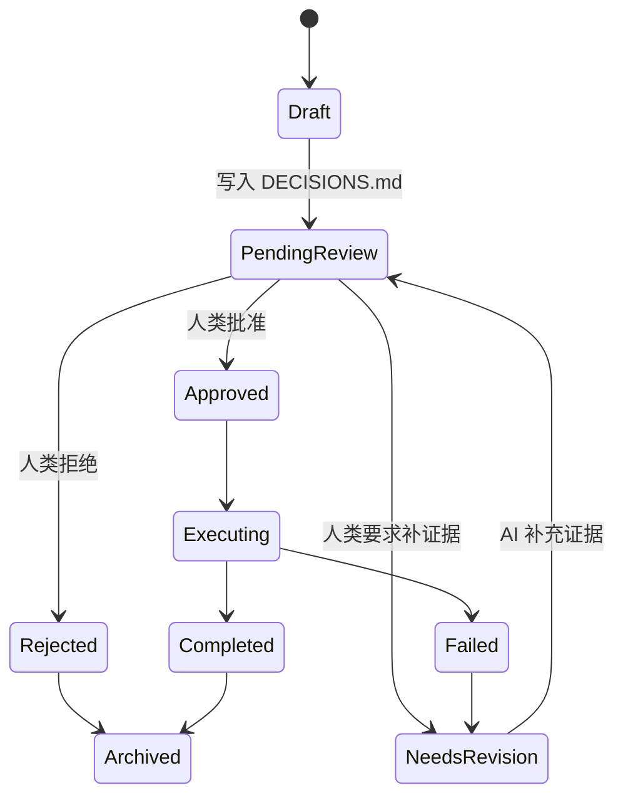

# 全自动执行与人工审核机制

## 1. 总原则

AI 默认自动执行可证据化、可回滚、低风险、规则明确的任务。AI 必须把不可自动决定的问题写入 `DECISIONS.md`，并继续执行不依赖该决策的任务。

禁止因为一个人类决策点而停止整个科研流程。

## 2. 自动执行白名单

AI 可以自动完成：

1. 检索公开论文和公开数据说明。
2. 建立文献矩阵。
3. 提取论文结构化信息。
4. 生成研究问题候选。
5. 生成实验协议草案。
6. 运行已批准的实验。
7. 生成图表和统计摘要。
8. 整理失败案例。
9. 生成论文草稿。
10. 生成审稿模拟报告。
11. 归档日志、结果、引用、复现说明。

## 3. 必须人工审核清单

AI 遇到以下事项必须停止该分支，并写入 `DECISIONS.md`：

| 类别 | 必须人审事项 |
|---|---|
| 研究方向 | 最终研究问题、贡献点、论文定位 |
| 数据 | 非公开数据、敏感数据、许可不明数据 |
| 实验 | 主指标、baseline 集合、实验协议冻结 |
| 结论 | 是否声称方法有效、是否声称优于 baseline |
| 写作 | 标题、摘要、贡献点、limitations |
| 伦理 | IRB、隐私、双重用途、金融/医疗/法律风险 |
| 发布 | 投稿、公开仓库、公开数据、预印本 |
| 署名 | 作者顺序、贡献声明、致谢 |
| 资源 | 高成本 API、GPU 长任务、付费数据 |

## 4. 决策写入触发条件

出现以下任一情况，AI 必须写入 `DECISIONS.md`：

1. 当前任务存在多个合理路径，且选择会影响研究方向。
2. AI 无法确认某个引用、数据来源或实验结论。
3. 任务涉及伦理、隐私、法律、预算或对外发布。
4. 后续多个任务依赖该判断。
5. AI 置信度低于当前阶段要求。
6. 两个以上 Agent 对同一问题给出冲突建议。
7. 人类曾明确要求该类问题必须审批。

## 5. 决策状态机



| 状态 | 含义 | 允许动作 |
|---|---|---|
| `Draft` | AI 已识别问题但尚未提交审核 | 补充上下文 |
| `PendingReview` | 等待人类审批 | 人类批准、拒绝或要求修改 |
| `Approved` | 已批准 | AI 可执行对应动作 |
| `Rejected` | 已拒绝 | AI 不得执行该动作 |
| `NeedsRevision` | 需要 AI 补充材料 | AI 补证后重新提交 |
| `Executing` | AI 正在执行已批准动作 | 记录执行过程 |
| `Completed` | 执行完成 | 写入审计结果 |
| `Failed` | 执行失败 | 写入失败原因并升级 |
| `Archived` | 决策关闭 | 不再修改，除非创建新决策 |

## 6. 决策登记格式

每个决策项必须包含：

```markdown
### DEC-YYYYMMDD-NNN

Status: PendingReview
Priority: P0 / P1 / P2 / P3
Blocking level: Blocking / Partial-Blocking / Non-Blocking
Owner: human
Raised by: <agent name>
Date:
Deadline:
Related task:
Related files:

Question:

Context:

Options:
1. 
2. 
3. 

AI recommendation:

Evidence:

Risk if approved:

Risk if rejected:

What is blocked:

What AI will continue doing:

Human decision:

Decision rationale:

Follow-up actions:
```

## 7. 阻塞等级

| 阻塞等级 | 定义 | AI 行为 |
|---|---|---|
| `Blocking` | 没有人类决策则不能继续该主线任务 | 暂停该任务，转向其他任务 |
| `Partial-Blocking` | 只阻塞部分分支 | 暂停受影响分支，继续无依赖分支 |
| `Non-Blocking` | 不影响当前执行 | 记录决策，继续执行 |

## 8. 非阻塞继续规则

写入决策项后，AI 必须立即列出仍可推进的任务。

示例：

| 决策阻塞项 | AI 可继续任务 |
|---|---|
| 等待人类选择研究问题 | 文献卡片、领域术语表、数据集清单 |
| 等待 baseline 确认 | 实现已确定 baseline、整理 baseline 论文 |
| 等待数据许可确认 | 查找替代公开数据集、写数据风险说明 |
| 等待投稿目标确认 | 改善论文结构、补引用、审稿模拟 |
| 等待是否补实验 | 分析已有结果、整理失败案例、检查统计方法 |

## 9. 升级规则

| 触发条件 | 升级等级 | 响应要求 |
|---|---|---|
| 涉及伦理、隐私、法律、医学、人类被试 | P0 | 立即停止相关动作 |
| 准备投稿、发布、发邮件、公开仓库 | P0 | 立即停止相关动作 |
| 实验结论与假设相反或存在重大不确定性 | P1 | 暂停相关分支，继续无关任务 |
| 多个 Agent 结论冲突 | P1 | 启动冲突报告和人审 |
| 引用无法验证但被用于关键论点 | P1 | 不得进入正文 |
| 成本超过预算阈值 | P1 | 等待人审 |
| 数据集许可证不明确 | P1 | 停止使用该数据 |
| 任务失败超过 3 次 | P2 | 记录并尝试替代路径 |
| 外部工具/API 返回异常 | P2 | 记录并降级处理 |

## 10. 审核粒度

人类审核不应要求人类接管所有工作。AI 必须提交可快速判断的材料：

1. 一个明确问题。
2. 2 到 4 个选项。
3. AI 推荐。
4. 支持证据。
5. 选错的风险。
6. 不决策时 AI 将继续做什么。

## 11. 审批超时策略

如果超过设定时间未收到人类回复：

1. AI 不得默认批准高风险事项。
2. AI 可继续低风险任务。
3. AI 应每次运行结束时汇总待审批事项。
4. 若等待项阻塞主路径，AI 应提出保守替代方案，但不得执行需要审批的动作。

## 12. 人工审核记录

每次人类审核都必须记录：

1. 审核人。
2. 审核时间。
3. 决策内容。
4. 决策理由。
5. 受影响的任务、文档、实验。
6. 是否需要重跑实验或修改论文。

## 13. 禁止自动批准

以下事项永远不得自动批准：

1. 投稿或公开发布。
2. 使用敏感或许可不明数据。
3. 声称达到 SOTA。
4. 署名和贡献声明。
5. 删除不利实验。
6. 改变已冻结主指标。
7. 规避伦理审查。
