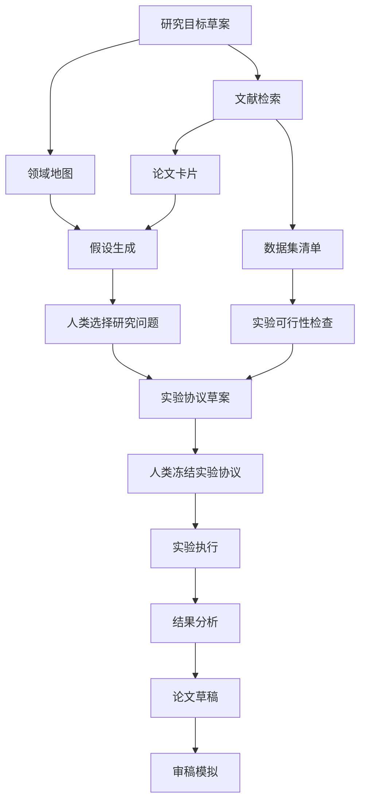

# 多 Agent 并行协作协议

## 1. 目标

本协议规定 AI 科研任务如何拆分给多个 Agent 并行执行，以及如何在存在依赖、冲突和人类决策点时继续推进。

## 2. 角色池

| Agent | 首选 skill/plugin | 职责 | 主要产出 |
|---|---|---|---|
| Research Orchestrator | `architecture-designer`, `automation-workflows` | 总控任务图、依赖、审核门 | task graph、状态表 |
| Domain Analyst | `bmad-domain-research` | 领域地图、术语、问题空间 | domain-map、open-problems |
| Literature Scout | `Hugging Face`, web search | 论文发现、引用追踪 | paper matrix |
| Paper Reader | `bmad-technical-research` | 论文精读、证据抽取 | paper cards、evidence log |
| Hypothesis Agent | `bmad-domain-research` | 研究假设生成与排序 | hypothesis backlog |
| Experiment Designer | `bmad-technical-research` | 实验协议、baseline、指标 | experiment protocol |
| Execution Agent | `automation-workflows`, shell/GitHub | 运行实验、记录日志 | run logs、result files |
| Statistics Agent | statistical tools/spreadsheets | 统计分析、图表、显著性 | tables、figures |
| Writer Agent | `documents`, Markdown editor | 论文草稿 | manuscript draft |
| CCF C Reviewer Agent | `bmad-review-adversarial-general`, `bmad-review-edge-case-hunter` | 按 CCF C 会审稿标准检查创新性、实验、复现和拒稿风险 | CCF C reviewer report |
| Reviewer Agents | `bmad-advanced-elicitation` | 模拟审稿、红队检查 | review report |
| Archivist Agent | `automation-workflows`, GitHub | 归档复现材料 | artifact manifest |

## 3. 并行原则

1. 只要任务之间没有硬依赖，就必须并行。
2. 每个 Agent 必须拥有明确输入、输出、完成标准。
3. Agent 不得修改其他 Agent 的责任文件，除非 Orchestrator 明确授权。
4. 冲突必须写入 conflict log，不得私自覆盖。
5. 任何 Agent 遇到人类决策点，都必须登记到 `DECISIONS.md`，然后返回任务池领取非阻塞任务。

## 4. 任务状态

| 状态 | 含义 |
|---|---|
| `todo` | 未开始 |
| `in_progress` | Agent 正在执行 |
| `blocked_human` | 需要人类决策，但只阻塞当前分支 |
| `blocked_dependency` | 等待另一个任务产出 |
| `review_ready` | 等待人类或 reviewer 审核 |
| `revision_needed` | 审核后需要修改 |
| `done` | 完成并通过质量门 |
| `archived` | 已归档 |

## 5. 并行任务池字段

每个任务必须包含以下字段：

```markdown
### Task ID
唯一任务编号。

### Task Name
任务名称。

### Assigned Agent
负责 Agent。

### Status
Backlog / Ready / Running / Blocked / Waiting Human Review / Done / Rejected。

### Priority
P0 / P1 / P2 / P3。

### Dependencies
依赖任务 ID。

### Inputs
所需输入。

### Expected Outputs
必须产出的结果。

### Evidence Requirements
必须附带的证据。

### Human Review Required
Yes / No。

### Blocker Description
如果阻塞，说明阻塞原因。

### Safe-To-Continue Scope
即使当前任务阻塞，仍可继续推进的相关任务。

### Quality Gate
完成前必须通过的质量门。
```

## 6. 任务分发格式

```markdown
## Task

ID:
Owner Agent:
Skill/plugin:
Input:
Expected output:
Allowed actions:
Forbidden actions:
Dependencies:
Human review required:
Completion criteria:
Fallback task if blocked:
```

## 7. Agent 输出格式

每个 Agent 必须用以下结构返回：

```markdown
## Result

Task ID:
Status:
Files produced or updated:
Evidence used:
Claims made:
Open questions:
Human decisions required:
Conflicts:
Recommended next tasks:
```

## 8. Agent 交接报告格式

```markdown
## Agent Handoff Report

### Task ID
任务编号。

### Agent
执行 Agent。

### Status
Done / Blocked / Waiting Human Review / Failed。

### Summary
一句话概括结果。

### Inputs Used
使用的输入材料。

### Outputs Produced
产出内容列表。

### Key Findings
关键发现。

### Evidence
证据来源。

### Assumptions
做出的假设。

### Limitations
当前结果的局限。

### Open Questions
未解决问题。

### Human Review Items
需要人类审核的问题。

### Downstream Recommendations
建议下游 Agent 如何使用本结果。

### Quality Gate Result
通过 / 未通过 / 需要复核。
```

## 9. 阻塞处理协议

当 Agent 遇到问题时，先判断问题类型：

| 问题类型 | 处理方式 |
|---|---|
| 缺少事实来源 | 继续检索，不需要人审 |
| 多个合理研究方向 | 写入 `DECISIONS.md`，继续做共同前置工作 |
| 数据集许可不明 | 写入 `DECISIONS.md`，寻找替代数据集 |
| baseline 是否纳入 | 写入 `DECISIONS.md`，继续实现已确定 baseline |
| 实验失败 | 自动排查；若改变实验设计则人审 |
| 结果与假设相反 | 写入 `DECISIONS.md`，继续失败分析 |
| 投稿目标选择 | 必须人审；继续格式无关修订 |

## 10. 冲突解决

常见冲突：

1. 两个 Paper Reader 对同一论文结论理解不同。
2. Experiment Designer 和 Statistics Agent 对指标选择不同。
3. Writer Agent 的贡献表述超出实验支持。
4. Reviewer Agent 认为主张过强。
5. CCF C Reviewer Agent 给出 `Weak Reject-level` 或 `Reject-level`。

解决流程：

1. 各 Agent 写明证据。
2. Orchestrator 汇总冲突。
3. 若能通过证据判定，自动解决并记录。
4. 若涉及价值判断或研究方向，写入 `DECISIONS.md`。
5. 决策未返回前，继续执行不依赖该冲突的任务。

### 冲突报告格式

```markdown
## Conflict Report

### Conflict ID
CONFLICT-YYYYMMDD-序号

### Conflict Type
Literature / Interpretation / Experiment / Writing / Priority / Ethics

### Agents Involved
涉及 Agent。

### Claims In Conflict
冲突陈述。

### Evidence For Claim A
支持 A 的证据。

### Evidence For Claim B
支持 B 的证据。

### Possible Resolutions
可选解决方案。

### AI Recommendation
AI 推荐处理方式。

### Downstream Impact
影响的任务、章节或实验。

### Human Review Required
Yes / No。
```

## 11. 并行任务图示例



## 12. 周期汇总报告格式

Orchestrator Agent 每个周期必须输出：

```markdown
## Research Cycle Report

### Cycle ID
周期编号。

### Date
日期。

### Overall Status
总体状态。

### Completed Tasks
已完成任务。

### Running Tasks
正在执行任务。

### Blocked Tasks
阻塞任务。

### Human Review Queue
需要人类决策的问题。

### Key Findings
关键发现。

### Evidence Added
新增证据。

### Risks
当前风险。

### Conflicts
当前冲突。

### Next Parallel Task Pool
下一轮可并行任务。

### Recommended Human Actions
建议人类处理事项。
```

## 13. 质量门

每个阶段进入下一阶段前，Orchestrator 必须检查：

1. 输出是否存在。
2. 证据是否可追溯。
3. 人类决策是否已登记。
4. 是否有未处理冲突。
5. 是否有被阻塞但可替代推进的任务。
6. 是否违反必须人审规则。
7. 若处于论文初稿后阶段，是否已有 `CCF_C_REVIEWER_AGENT.md` 格式的审稿报告。
8. CCF C 审稿报告中的 P0/P1 问题是否已写入 `RISKS.md` 或 `DECISIONS.md`。
