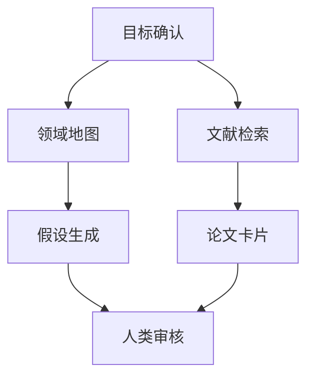

# AI 科研运行记录模板

运行 ID：  
日期：  
研究主题：  
人类负责人：  
AI Orchestrator：  
当前阶段：  

## 1. 本次运行目标

```text
写明本次运行要完成什么，不要写成长期愿景。
```

## 2. 已知输入

| 输入 | 来源 | 可信度 | 备注 |
|---|---|---|---|
|  |  |  |  |

## 3. Agent 分工

| Agent | skill/plugin | 任务 | 状态 | 输出 |
|---|---|---|---|---|
| Research Orchestrator | `architecture-designer` | 任务图和状态维护 | todo |  |
| Domain Analyst | `bmad-domain-research` | 领域地图 | todo |  |
| Literature Scout | `Hugging Face` | 文献检索 | todo |  |
| Paper Reader | `bmad-technical-research` | 论文卡片 | todo |  |
| CCF C Reviewer Agent | `bmad-review-adversarial-general` | CCF C 审稿检查 | todo |  |
| Reviewer Agent | `bmad-advanced-elicitation` | 红队审查 | todo |  |

## 4. 任务图



## 5. 本次自动执行事项

| 任务 | 负责人 | 结果 | 证据位置 |
|---|---|---|---|
|  |  |  |  |

## 6. 人类决策事项

| 决策 ID | 问题 | 状态 | 阻塞内容 | AI 继续事项 |
|---|---|---|---|---|
|  |  |  |  |  |

## 7. 证据日志

```text
Claim:
Source:
Evidence location:
Confidence:
Used for:
```

## 8. 实验记录

| 实验 ID | 协议版本 | 命令 | 数据版本 | seed | 状态 | 结果 |
|---|---|---|---|---|---|---|
|  |  |  |  |  |  |  |

## 9. 质量检查

| 检查项 | 状态 | 备注 |
|---|---|---|
| 引用可追溯 | pending |  |
| 关键结论有人审 | pending |  |
| 实验可复现 | pending |  |
| 冲突已处理 | pending |  |
| 决策项已登记 | pending |  |
| CCF C 审稿已完成 | pending |  |

## 10. 下一步

1. 
2. 
3. 
