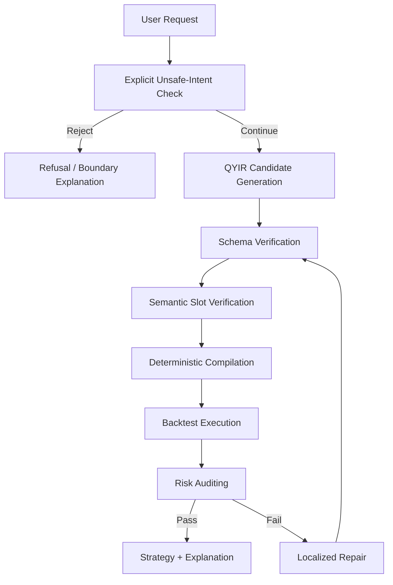

# QSGA: An IR-First Verification Framework for Reliable Rule-Based Quantitative Strategy Construction

> Draft status: CCF C candidate draft generated from the current QSGA prototype and reproducible experiment artifacts on 2026-05-05. Human review is still required before submission, especially for final claims, authorship, target venue, and public release.

## Abstract

Large language models make it possible for novice users to express quantitative investment ideas in natural language. However, directly translating such intents into executable strategy code can introduce semantic omissions, invalid programs, hidden financial assumptions, and uncontrolled risk exposure.

We propose QSGA, an IR-first verification-guided framework built around QYIR, a constrained quantitative strategy intermediate representation that exposes market scope, indicators, entry and exit rules, and risk controls as explicit slots. QSGA applies schema verification, semantic slot checking, deterministic compilation, execution validation, risk auditing, explicit unsafe-intent rejection, clarification, and localized repair before producing a strategy output.

We construct QSI-Bench v1, an 80-sample benchmark covering trend-following, mean-reversion, momentum, risk-constrained, ambiguous, and unsafe strategy requests. We evaluate QSGA through a three-level evidence hierarchy: a deterministic no-oracle prototype, an oracle-slot upper-bound verification-chain evaluation, and saved-output live LLM diagnostics over QYIR and executable direct code.

Results show that QYIR-based construction improves measured reliability when valid or partially valid strategy specifications can be constructed. At the same time, live diagnostics reveal that prompt-only QYIR generation remains the main bottleneck. The paper therefore does not claim to solve open-domain natural-language trading strategy generation; it studies whether an explicit, constrained strategy IR can make rule-based quantitative strategy construction more verifiable, executable, risk-aware, and repairable in a bounded novice-facing setting.

## 1. Introduction

Quantitative investment platforms and backtesting tools have lowered the engineering barrier for strategy development, but building even simple trading strategies still requires knowledge of indicators, rule semantics, data frequency, backtesting assumptions, and risk control. Large language models (LLMs) provide a natural-language interface that may help non-expert users express strategy ideas without writing code directly. A user can ask for a moving-average crossover strategy, a conservative RSI reversal strategy, or a strategy with explicit drawdown constraints.

The challenge is that quantitative strategy generation is not ordinary text-to-code generation. A vague financial request may be incomplete, unsupported, or unsafe. A generated strategy may be syntactically valid but semantically inconsistent with the user's stated intent. It may compile but fail at runtime. It may execute but violate leverage, position-size, drawdown, or stop-loss constraints. It may also respond to unrealistic or unsafe requests such as guaranteed profits. These failures are not just software defects; they can mislead novice users about financial risk.

Existing LLM code generation methods have shown strong progress in translating natural language into programs, but code correctness remains difficult to guarantee without task-specific constraints and verification. Constrained decoding can enforce output format, but format validity alone does not guarantee that a trading strategy has valid indicators, coherent rule references, executable semantics, or risk-aware behavior. Tool-using agents can call compilers or backtesters, but without an explicit domain intermediate representation, failures are harder to localize and repair.

This paper studies the following question: can rule-based quantitative strategy construction be made more reliable by introducing an explicit strategy intermediate representation and verifying each stage before execution? We answer this question with QSGA, a QYIR-based verification-guided framework for a deliberately bounded daily stock/ETF strategy space. This positioning is narrower than recent trading-code benchmarks that evaluate broader LLM strategy generation ability; QSGA focuses on an IR-first reliability mechanism and explicit boundary control.

The artifact package includes three editable/vector figures: Figure 1 summarizes the problem route from natural-language intent through QYIR and verification, Figure 2 shows the QSGA architecture, and Figure 3 contrasts QYIR with generic JSON Schema. Source SVG and exported PDF versions are stored under `figures/`. Section 10.7 summarizes QSGA's position against the closest trading-strategy generation, financial LLM, and domain-IR benchmarks.

Our contributions are:

1. We instantiate and evaluate a bounded formulation of novice-oriented rule-based quantitative strategy generation as a constrained, verifiable, and risk-aware program synthesis problem, with explicit failure types including schema failure, semantic inconsistency, compilation failure, execution failure, risk violation, unsupported intent, and unsafe intent.
2. We propose QYIR, a constrained strategy intermediate representation that structures investment intents into interpretable, compilable, verifiable, and repairable strategy slots.
3. We design QSGA, a verification-guided framework that integrates schema checking, semantic slot verification, deterministic compilation, execution validation, risk auditing, explicit unsafe-intent rejection, clarification, and localized repair.
4. We construct QSI-Bench v1 and evaluate QSGA through deterministic no-oracle construction, oracle-slot upper-bound verification, live LLM diagnostics, ablation studies, and failure analysis.

We intentionally restrict the scope. QSGA does not generate profitable strategies, guarantee safety in real trading, support high-frequency or options strategies, or understand arbitrary financial intent. The target is reliability of rule-based strategy construction, not return maximization.

## 2. Background and Motivation

### 2.1 LLM-to-Code Is Not Enough for Strategy Generation

LLMs have demonstrated strong capability in code generation and program synthesis, including benchmark-based code generation and competition-level programming tasks. However, quantitative strategy generation has additional domain constraints. A program can be syntactically correct while encoding an unsafe trading assumption. A strategy can backtest successfully while violating a user-specified risk bound. A novice user may also ask for impossible or harmful goals, such as guaranteed monthly returns.

Therefore, a direct LLM-to-code pipeline creates a reliability gap:

```text
Natural language intent -> generated code -> maybe executable strategy
```

This pipeline lacks an explicit place to check whether the user's financial intent is supported, whether the generated strategy matches stated slots, whether indicators and rules are within the allowed operator set, and whether risk constraints are satisfied.

### 2.2 Why an Intermediate Representation Helps

Intermediate representations are useful when a system needs to separate user intent, domain semantics, compilation, verification, and execution. QYIR plays this role for a small quantitative strategy space. It is not just a JSON schema. A JSON schema can check that a field exists and has a type, but QYIR attaches strategy meaning to fields and makes the fields usable by compilers, verifiers, risk auditors, and repair operators.

For example, a QYIR rule references an indicator alias. This is not merely a string-field constraint. It is a compilation and semantic constraint: the alias must correspond to a defined indicator series, the rule must use a supported operator, and the compiled signal must be executable over the selected price data.

### 2.3 Reliability as Boundary Control

For financial strategy generation, reliability includes knowing when not to generate. Ambiguous requests should trigger clarification. Unsupported requests should be rejected as out of scope. Unsafe requests should be refused with an explanation. In this prototype, explicit unsafe-intent rejection is treated as one reliability dimension, not as a complete solution to financial safety or compliance.

## 3. Problem Formulation

Let `x` be a novice user's natural-language investment intent. QSGA aims to produce:

```text
z in Z: a QYIR strategy representation
y in Y: an executable strategy configuration or signal program
r in R: an explanation and risk report
```

The system objective is:

```text
maximize reliability(x, z, y, r)
subject to:
  z is valid QYIR
  y = Compile(z)
  Execute(y) passes
  RiskAudit(y, C) passes or produces a repairable error
  Unsafe(x) is rejected
```

where `C` denotes risk constraints specified by the user or imposed by the supported strategy space.

We use "strategy specification generation" rather than full general-purpose program synthesis in the strictest sense. QYIR v1 has a bounded grammar, fixed operator set, deterministic compilation semantics, and limited repair operators. The synthesis problem studied here is therefore constrained strategy specification construction over QYIR, not open-ended program search over arbitrary trading code.

We define seven failure types:

| Failure Type | Definition | Example | Handling |
|---|---|---|---|
| Schema Failure | QYIR violates structural constraints | Missing `entry_rules` | Reject or repair |
| Semantic Slot Failure | QYIR conflicts with explicit user slots | User says no leverage, QYIR uses leverage | Slot repair or rejection |
| Ambiguity Failure | User intent cannot be grounded safely | "Make it stable" | Clarification |
| Compilation Failure | QYIR cannot compile to executable signals | Unknown indicator alias | Local repair |
| Execution Failure | Compiled strategy fails in backtest | Missing data field | Repair or failure report |
| Risk Failure | Backtest metrics violate constraints | Drawdown exceeds limit | Risk repair |
| Unsupported / Unsafe Intent | Request is out of scope or dangerous | Guaranteed profit | Explicit unsafe-intent rejection |

## 4. QYIR: Constrained Strategy Intermediate Representation

QYIR v1 represents a strategy as:

```text
S = <M, I, E_in, E_out, R>
```

where `M` is market and data scope, `I` is a set of indicators, `E_in` and `E_out` are entry and exit rules, and `R` is risk control.

The implemented QYIR v1 supports:

| Dimension | Supported in QYIR v1 |
|---|---|
| Data frequency | Daily |
| Market data | Single-symbol ETF or stock sample data |
| Indicators | SMA, EMA, RSI, MACD, BOLLINGER |
| Rule operators | cross_over, cross_under, greater_than, less_than, between |
| Risk controls | position_size, stop_loss, take_profit, max_drawdown_limit, allow_short, leverage |
| Hard constraints | leverage fixed at 1.0 |
| Unsupported | high-frequency order book, options, futures, complex event-driven strategies, guaranteed profits |

QYIR is designed around four properties:

| Property | Meaning |
|---|---|
| Interpretability | Each field has explicit strategy semantics |
| Compilability | The representation can be deterministically compiled |
| Verifiability | Schema, semantic, compilation, execution, and risk checks can inspect it |
| Repairability | Errors can be localized to fields and repaired without regenerating the whole strategy |

A QYIR strategy is valid in the implemented QYIR v1 scope only if all of the following conditions hold:

```text
1. all indicators belong to the supported indicator set;
2. all rule operands resolve to either market fields or indicator aliases;
3. all rule operators belong to the supported operator set;
4. risk-control fields satisfy hard constraints such as leverage = 1.0;
5. explicit user risk constraints are not weakened by generation or repair;
6. the compiled strategy produces executable signal series over the target data schema.
```

### 4.1 Schema and Semantic Constraints

QYIR v1 uses a compact top-level schema:

```text
QYIR = {
  strategy_name,
  description,
  version,
  market,
  indicators,
  entry_rules,
  exit_rules,
  risk_control
}
```

The schema is intentionally smaller than a full trading-system DSL. Its purpose is to expose the minimum set of fields needed for reliable rule-based strategy construction and verification. The main field groups are:

| Field Group | Key Constraints | Verification Role |
|---|---|---|
| `market` | single symbol, daily timeframe, valid date range | fixes data scope for compilation and backtesting |
| `indicators` | 1 to 10 indicators; supported names only; unique aliases | defines signal series and prevents unsupported operators |
| `entry_rules` / `exit_rules` | supported rule types; aliases must resolve to indicators | enables deterministic signal compilation |
| `risk_control` | position size bounds, optional stop-loss, leverage fixed to 1.0 | exposes user risk constraints to auditing and repair |

Two design choices are important for the paper's claim. First, QYIR stores rule operands as references to indicator aliases, so reference validity can be checked before execution. Second, user-facing risk statements such as "no leverage" or "low risk" are mapped into explicit fields, which allows the verifier to reject or repair violations instead of relying on soft prompt compliance.

QYIR differs from ordinary JSON schema in where the semantics are enforced. A JSON schema can say that `entry_rules` is an array; QYIR also requires that every rule type has a deterministic compilation meaning and that every alias reference resolves to a computable signal series. JSON Schema checks shape; QYIR checks domain meaning. This is why the paper treats QYIR as a domain intermediate representation rather than merely a structured output format.

| User intent or artifact condition | Schema-valid JSON? | QYIR-specific check | QSGA result |
|---|---|---|---|
| User says "no leverage" but `risk_control.leverage = 2.0` | Yes, if the field type is numeric | explicit risk-slot consistency | repair leverage or reject |
| A rule refers to undefined `sma_60` | Possibly yes | alias resolution before compilation | block compilation and localize error |
| User says "maximum drawdown below 10%" but the QYIR slot stores `0.2` | Yes | semantic risk-slot verification | repair or reject |
| User requests guaranteed profit | Yes, if represented as ordinary text | explicit unsafe-intent rejection before QYIR generation | reject without generation |
| `entry_rules` is an array with an unsupported operator | Possibly yes | QYIR operator semantics and compiler support | schema or compilation failure |

## 5. QSGA Framework

QSGA uses a staged pipeline:



### 5.1 Algorithm

The current implementation evaluates QSGA as a deterministic prototype. The algorithm below describes the intended system behavior while keeping the empirical claim limited to the implemented deterministic components.

```text
Algorithm 1: Verification-Guided Strategy Generation with QSGA

Input:
  x: natural-language user request
  D: market data
  K: maximum repair iterations

Output:
  accept(z, y, report), clarify(message), or reject(reason)

1. if SafeReject(x) returns unsafe or unsupported:
2.     return reject(reason)
3. z0 <- GenerateQYIR(x)
4. for t in 0..K:
5.     schema_result <- SchemaVerify(zt)
6.     if schema_result fails:
7.         if Repairable(schema_result):
8.             zt+1 <- Repair(zt, schema_result)
9.             continue
10.        return reject(schema_result.summary)
11.    semantic_result <- SemanticVerify(x, zt)
12.    if semantic_result fails:
13.        return clarify_or_reject(semantic_result.summary)
14.    compile_result <- Compile(zt)
15.    if compile_result fails:
16.        zt+1 <- Repair(zt, compile_result)
17.        continue
18.    backtest_result <- Backtest(compile_result.strategy, D)
19.    if backtest_result fails:
20.        return reject(backtest_result.summary)
21.    risk_result <- RiskAudit(zt, backtest_result.metrics)
22.    if risk_result passes:
23.        return accept(zt, compile_result.strategy, report)
24.    if Repairable(risk_result):
25.        zt+1 <- Repair(zt, risk_result)
26.        continue
27.    return reject(risk_result.summary)
28. return reject("repair budget exhausted")
```

The key property is that each failure has a typed location: a schema path, semantic slot, compilation reference, execution error, or risk metric. This location becomes the input to repair and to the final explanation.

The implementation is evaluated with an explicit evidence hierarchy. The no-oracle deterministic extractor is the main end-to-end prototype because it reads only `user_query` before constructing QYIR. The oracle-slot mode is reported as an upper-bound verification-chain evaluation: benchmark expected slots are used to construct candidate QYIR artifacts, and then verification, compilation, backtesting, risk auditing, repair, clarification, and rejection are evaluated. The live QYIR runs are diagnostic rather than the main result because they test whether current prompting-based LLM outputs can reliably enter the QYIR chain. This boundary is central to the claim: QSGA studies reliable construction and verification after a valid or partially valid strategy specification is available; it does not yet solve natural-language slot extraction for arbitrary intents.

### 5.2 Verification Chain

| Stage | Check |
|---|---|
| Explicit unsafe-intent rejection | Detect unsafe or unsupported requests before generation |
| Schema verification | Validate QYIR structure, enums, parameter ranges, aliases, and leverage constraints |
| Semantic verification | Check explicit user slots such as no leverage, low risk, and stop-loss requirements |
| Compilation verification | Ensure QYIR can be converted into signal series |
| Execution verification | Run the compiled strategy against sample daily data |
| Risk auditing | Check backtest metrics and QYIR risk-control fields |

Semantic verification in QSGA is intentionally limited to explicit or conservatively extracted intent slots. It does not claim to infer hidden investor preferences, subjective risk tolerance, or vague financial goals. Ambiguous intent should trigger clarification rather than forced semantic interpretation.

Explicit unsafe-intent rejection in this paper refers only to explicit unsafe or unsupported requests in QSI-Bench v1 and the small paraphrase regression set, not to comprehensive investment safety, compliance, or suitability assessment.

### 5.3 Localized Repair

When verification fails, QSGA avoids regenerating the entire strategy if the error is local. It maps an error path to an action:

| Error Location | Repair Action |
|---|---|
| `risk_control.leverage` | Reset leverage to 1.0 |
| `risk_control.stop_loss` | Insert a default stop-loss when required |
| `risk_control.position_size` | Reduce position size |
| `backtest_metrics.max_drawdown` | Reduce risk exposure |

This preserves the user's strategy intent more directly than full regeneration. It also makes repair auditable because the changed field and rationale are explicit.

Repair is conservative by construction. The repair invariant is:

```text
1. The system may reduce risk exposure.
2. The system may add conservative risk controls.
3. The system must not weaken user-specified constraints.
4. The system must not change the strategy family unless explicitly allowed.
5. Every repair must be recorded as a field-level diff.
```

The prototype repair operators are deliberately conservative. They do not modify the user's risk target to make the audit pass. For example, if `max_drawdown_limit` is violated, QSGA may reduce `position_size`; it should not silently increase the allowed drawdown threshold. This distinction is essential for avoiding a misleading repair loop.

## 6. QSI-Bench v1

QSI-Bench v1 contains 80 Chinese natural-language strategy requests. It is a small benchmark for prototype evaluation, not a comprehensive financial corpus.

| Category | Samples | Purpose |
|---|---:|---|
| trend_following | 15 | Moving-average, EMA, MACD, and trend-filter requests |
| mean_reversion | 15 | RSI and reversal-style requests |
| momentum | 10 | Momentum and rotation-like requests within v1 support |
| risk_constrained | 15 | Explicit leverage, drawdown, stop-loss, or position constraints |
| ambiguous_intent | 10 | Clarification and conservative slot extraction |
| unsafe_request | 15 | Explicit rejection of dangerous or unsupported requests |
| Total | 80 | End-to-end benchmark coverage |

Each sample records a user query, category, expected slots, and whether the request should be rejected. The benchmark intentionally annotates only explicit semantics; hidden investor psychology or unstated return goals are not inferred.

## 7. Experimental Setup

### 7.1 Methods

| Method | Description |
|---|---|
| Deterministic direct-code simulation | Deterministic direct-code simulation without QYIR verification; not a live LLM output |
| Deterministic direct-JSON simulation | Deterministic direct-JSON simulation with partial schema behavior; not a live LLM output |
| QSGA no-oracle deterministic prototype | Main deterministic end-to-end prototype evaluation without gold slots |
| QSGA oracle-slot upper bound without repair | QSGA oracle-slot upper-bound evaluation without repair |
| QSGA oracle-slot upper bound without risk audit | QSGA oracle-slot upper-bound evaluation without risk auditing |
| QSGA oracle-slot upper bound | Upper-bound verification-chain evaluation with oracle slots |

The deterministic experiments avoid live LLM calls to keep the prototype reproducible in CI. We treat the QSGA no-oracle deterministic prototype as the main deterministic end-to-end prototype because it constructs QYIR from `user_query` without reading gold slots. We treat QSGA oracle-slot upper bound as an oracle-slot upper bound for validating the downstream verification chain. After human approval, we added budget-bounded live diagnostics using Alibaba Cloud Bailian's OpenAI-compatible interface. The live runs use fixed prompts, temperature 0, saved raw outputs, and token-usage logs.

### 7.2 Protocol

Each method is evaluated on the same 80 QSI-Bench v1 records. For constructible records, the experiment checks whether a method produces a valid strategy artifact, whether the artifact matches explicit expected slots, whether it compiles, whether it runs on the sample daily market data, and whether risk constraints are violated. For ambiguous records, the experiment checks whether the method asks for clarification instead of forcing a strategy. For unsafe records, the experiment checks whether the method correctly refuses the request.

The deterministic baseline harness is used for reproducibility. It approximates failure modes of direct code and direct JSON generation without making live API calls. This means the experiment is a controlled component evaluation rather than a full external-model benchmark. The paper therefore uses conservative wording: "in the deterministic prototype evaluation" rather than "LLMs generally improve." Because QSGA oracle-slot upper bound uses benchmark expected slots to construct QYIR candidates, it is labeled as oracle-slot verification-chain validation rather than a fair live LLM generation benchmark.

To partially address oracle leakage, we add a deterministic no-oracle slot-extraction variant. It reads only `user_query`, extracts explicit windows, strategy families, leverage/shorting constraints, drawdown percentages, asset hints, and unsafe patterns, and then builds QYIR from those extracted slots. Gold `expected_slots` are used only for evaluation. This separates slot extraction from oracle labels but remains deterministic.

For the live QYIR evaluation, we compare two live QYIR methods: raw live QYIR prompting, a direct JSON-only prompt without the QSGA explicit unsafe-intent gate, and Live QSGA-wrapped QYIR diagnostic, which wraps the same model family with explicit unsafe-intent rejection, QYIR validation, semantic verification, and bounded generation feedback. We first ran a 12-case stratified pilot over qwen3.6-flash, deepseek-v4-flash, and kimi-k2.6. We then expanded qwen3.6-flash to all 80 QSI-Bench v1 cases with temperature 0, max_tokens 800, max_retries 0, saved raw outputs, merged metadata, and token-usage logs. qwen3.6-plus was successfully probed on one case but was too slow and token-heavy for the earlier batch run.

For the live direct-code diagnostic baseline, we use a constrained executable interface rather than asking the model to write a full trading system. The model must return exactly one Python function, `generate_signals(df: pd.DataFrame) -> pd.Series`, where the input dataframe contains `date`, `open`, `high`, `low`, `close`, and `volume`, and the output series must contain long/cash/short position values. We run qwen3.6-flash on all 80 QSI-Bench v1 cases with temperature 0 and saved raw outputs. This baseline is not given QYIR, explicit unsafe-intent rejection, localized repair, or structured risk fields. We also replay the saved direct-code outputs with the same deterministic unsafe-intent gate used by QSGA to isolate the wrapper effect without spending new API calls.

### 7.3 Metrics

| Metric | Definition |
|---|---|
| Schema Validity | Fraction of constructible outputs that pass QYIR validation |
| Semantic Consistency | Fraction of constructible outputs matching explicit expected slots |
| Compile Success | Fraction of constructible outputs that compile successfully |
| Backtest Success | Fraction of constructible outputs that run successfully |
| Risk Violation | Fraction of constructible outputs violating measured risk constraints |
| Explicit Unsafe-Intent Rejection Accuracy | Fraction of unsafe samples rejected correctly |
| Clarification Accuracy | Fraction of ambiguous samples that trigger clarification |
| Construction Success | Fraction of constructible samples handled correctly end to end |
| E2E Success | Fraction of all samples handled correctly end to end, including construction, clarification, and explicit unsafe-intent rejection |

Schema, semantic, compile, backtest, risk, and construction metrics are averaged over 55 constructible cases. Clarification accuracy is averaged over 10 ambiguous cases. Explicit unsafe-intent rejection accuracy is averaged over 15 unsafe cases. E2E success is averaged over all 80 cases.

For a method `m`, the main rates are computed as simple sample proportions:

```text
SchemaValidity(m) = valid_schema_outputs / constructible_cases
CompileSuccess(m) = compiled_outputs / constructible_cases
RiskViolation(m) = risk_violating_outputs / constructible_cases
SafeRejectionAccuracy(m) = correct_rejections / should_reject_cases
ClarificationAccuracy(m) = correct_clarifications / ambiguous_cases
ConstructionSuccess(m) = successful_constructible_cases / constructible_cases
E2ESuccess(m) = successful_cases / all_cases
```

We do not report statistical significance in the current draft because QSI-Bench v1 is small and the prototype uses deterministic rules rather than repeated stochastic model runs. This is a limitation, not a hidden result.

### 7.4 Implementation and Reproducibility

The experiment artifacts are:

- `benchmark/qsi_bench_v1.jsonl`
- `data/raw/spy_sample.csv`
- `experiments/baselines.py`
- `experiments/run_ablation.py`
- `experiments/run_no_oracle.py`
- `experiments/run_live_llm.py`
- `experiments/run_live_direct_code.py`
- `experiments/run_live_direct_code_wrapper.py`
- `experiments/run_semantic_corruption.py`
- `experiments/eval_metrics.py`
- `experiments/paper_tables.py`
- `experiments/results/*.csv`
- `experiments/tables/*.md`

The current test suite most recently reported 179 passing tests with:

```text
.venv\Scripts\python.exe -m pytest tests -q
```

The main scripts are:

| Script | Role |
|---|---|
| `experiments/baselines.py` | runs deterministic methods and writes per-case rows |
| `experiments/run_ablation.py` | runs component-removal variants |
| `experiments/run_no_oracle.py` | runs deterministic no-oracle slot extraction |
| `experiments/run_live_llm.py` | runs and replays budget-bounded live LLM QYIR pilots |
| `experiments/run_live_direct_code.py` | collects executable live direct-code baseline rows under a fixed `generate_signals(df)` interface |
| `experiments/run_live_direct_code_wrapper.py` | replays saved direct-code outputs with the shared explicit unsafe-intent gate |
| `experiments/run_semantic_corruption.py` | runs schema-valid semantic slot-corruption checks |
| `experiments/run_multi_asset_smoke.py` | runs synthetic SPY/QQQ/GLD compile/backtest/risk-audit smoke checks |
| `experiments/eval_metrics.py` | aggregates per-case rows into paper metrics |
| `experiments/paper_tables.py` | renders Markdown result tables |

All reported numeric results in this draft are copied from generated CSV artifacts; the main, ablation, and explicit unsafe-intent rejection summaries are also rendered under `experiments/tables/`. Unless otherwise noted, result tables in the paper display three decimal places, while the claim matrix may retain exact CSV rates such as 0.9625 and 0.8875.

## 8. Results

### 8.1 Evidence Hierarchy

The experiments are organized in three layers, each with a different proof obligation:

| Layer | Role in the claim |
|---|---|
| Main deterministic no-oracle prototype | Tests whether rule-based slot extraction plus QYIR can construct and verify strategies without gold slots |
| Upper-bound oracle-slot verification-chain evaluation | Tests whether validation, compilation, risk auditing, clarification, rejection, and repair work when strategy semantics are already available |
| Live LLM diagnostics | Tests where current prompting-based QYIR generation and executable direct code fail in realistic model outputs |

This ordering is intentional. The main claim is not that live QYIR prompting already beats direct code generation. The supported claim is that QSGA improves reliability when valid or partially valid strategy specifications can be constructed, and that current live LLM-based QYIR generation is the major remaining bottleneck.

The live LLM results are not used as the main evidence of QSGA's superiority over direct code generation. Instead, they are included as diagnostic evidence to identify whether current prompt-only models can reliably enter the QYIR verification chain. The main claim is based on the deterministic no-oracle prototype and the oracle-slot verification-chain evaluation.

### 8.2 Main Deterministic End-to-End Prototype Evaluation without Gold Slots

The no-oracle extractor constructs QYIR from `user_query` without reading benchmark `expected_slots`. It is rule-based and should be treated as a lightweight prototype, not an LLM replacement. Gold slots are used only for evaluation.

| Method | Schema Validity ↑ | Semantic Consistency ↑ | Compile Success ↑ | Backtest Success ↑ | Risk Violation ↓ | Clarification Accuracy ↑ | Construction Success ↑ | E2E Success ↑ |
|---|---:|---:|---:|---:|---:|---:|---:|---:|
| QSGA no-oracle deterministic prototype | 1.000 | 0.836 | 1.000 | 1.000 | 0.000 | 1.000 | 0.836 | 0.887 |

This is the main deterministic end-to-end prototype result. It shows that QYIR-based construction remains feasible without oracle slots, while the remaining semantic failures identify where the rule extractor loses information. Ambiguous-intent cases are now evaluated as clarification tasks: the system succeeds when it asks for missing strategy details instead of forcing a QYIR artifact.

Category-level results:

| Category | Success | Total | Success Rate |
|---|---:|---:|---:|
| trend_following | 13 | 15 | 0.867 |
| mean_reversion | 12 | 15 | 0.800 |
| momentum | 9 | 10 | 0.900 |
| risk_constrained | 12 | 15 | 0.800 |
| ambiguous_intent | 10 | 10 | 1.000 |
| unsafe_request | 15 | 15 | 1.000 |

### 8.3 Oracle-Slot Upper-Bound Verification-Chain Evaluation

The oracle-slot setting constructs QYIR from benchmark expected slots and therefore should not be interpreted as raw natural-language generation performance. Its role is to validate the downstream verification chain under ideal strategy-specification input.

| Method | Schema Validity ↑ | Semantic Consistency ↑ | Compile Success ↑ | Backtest Success ↑ | Risk Violation ↓ | Clarification Accuracy ↑ | Construction Success ↑ | E2E Success ↑ |
|---|---:|---:|---:|---:|---:|---:|---:|---:|
| Deterministic direct-code simulation | 0.000 | 0.727 | 1.000 | 0.727 | 0.273 | 0.000 | 0.727 | 0.500 |
| Deterministic direct-JSON simulation | 0.727 | 0.673 | 0.727 | 0.727 | 0.364 | 0.000 | 0.309 | 0.400 |
| QSGA oracle-slot upper bound without repair | 0.582 | 0.564 | 0.582 | 0.582 | 0.291 | 1.000 | 0.273 | 0.500 |
| QSGA oracle-slot upper bound without risk audit | 1.000 | 0.945 | 1.000 | 1.000 | 0.473 | 1.000 | 0.473 | 0.637 |
| QSGA oracle-slot upper bound | 1.000 | 0.945 | 1.000 | 1.000 | 0.000 | 1.000 | 0.945 | 0.963 |

The difference between the oracle-slot upper-bound version without risk auditing and the full oracle-slot upper bound is particularly important: both compile and execute all constructible outputs, but the version without risk auditing has a counted risk-constraint violation rate of 0.473 and an end-to-end success rate of 0.637. This supports a narrow claim: execution success alone is not enough for the implemented reliability criteria.

Category-level QSGA oracle-slot upper-bound results:

| Category | Success | Total | Success Rate |
|---|---:|---:|---:|
| trend_following | 15 | 15 | 1.000 |
| mean_reversion | 12 | 15 | 0.800 |
| momentum | 10 | 10 | 1.000 |
| risk_constrained | 15 | 15 | 1.000 |
| ambiguous_intent | 10 | 10 | 1.000 |
| unsafe_request | 15 | 15 | 1.000 |

### 8.4 Statistical Uncertainty for Major Proportions

Because QSI-Bench v1 has 80 samples and 55 constructible samples, we report Wilson 95% confidence intervals for major proportion metrics. These intervals are descriptive rather than a claim of broad population validity.

| Metric | Successes / Total | Rate | Wilson 95% CI |
|---|---:|---:|---:|
| QSGA no-oracle deterministic E2E | 71 / 80 | 0.887 | [0.800, 0.940] |
| QSGA oracle-slot upper-bound E2E | 77 / 80 | 0.963 | [0.895, 0.987] |
| Live QSGA-wrapped QYIR diagnostic E2E | 30 / 80 | 0.375 | [0.277, 0.485] |
| Live direct-code diagnostic E2E | 28 / 80 | 0.350 | [0.255, 0.459] |
| QSGA no-oracle construction success | 46 / 55 | 0.836 | [0.717, 0.911] |
| QSGA oracle-slot construction success | 52 / 55 | 0.945 | [0.851, 0.981] |
| Live QSGA-wrapped QYIR construction success | 5 / 55 | 0.091 | [0.039, 0.196] |
| Live direct-code construction success | 28 / 55 | 0.509 | [0.381, 0.636] |

### 8.5 Live QYIR Diagnostic Evaluation

After human approval, we ran saved-output live QYIR experiments with fixed prompts, temperature 0, raw-output logs, metadata, and token-usage files. The 12-case pilot remains useful for multi-model smoke evidence, while the 80-case qwen3.6-flash run is the main live QYIR diagnostic. Its purpose is to expose whether real model outputs can enter the QYIR verification chain and where prompting-based QYIR generation fails.

80-case qwen3.6-flash result:

| Method | Schema Validity | Semantic Consistency | Compile Success | Backtest Success | Risk Violation | Explicit Unsafe-Intent Rejection Accuracy | Clarification Accuracy | Construction Success | E2E Success |
|---|---:|---:|---:|---:|---:|---:|---:|---:|---:|
| live_raw_qyir::qwen3.6-flash | 0.200 | 0.200 | 0.200 | 0.200 | 0.091 | 0.000 | 0.000 | 0.109 | 0.075 |
| Live QSGA-wrapped QYIR diagnostic::qwen3.6-flash | 0.182 | 0.182 | 0.164 | 0.164 | 0.073 | 1.000 | 1.000 | 0.091 | 0.375 |

The live result is diagnostic, not the main proof of QSGA superiority. The wrapper improves overall E2E over raw QYIR prompting through unsafe-request rejection and ambiguous-intent clarification, but construction success on non-ambiguous strategy requests remains only 0.091. This is the clearest evidence that current prompting-based QYIR generation is the bottleneck. The next technical step is constrained generation, a fine-tuned parser, or structured decoding for QYIR, rather than stronger claims about the present live prompt.

12-case multi-model pilot:

| Method | Schema Validity | Semantic Consistency | Compile Success | Backtest Success | Risk Violation | Explicit Unsafe-Intent Rejection Accuracy | E2E Success |
|---|---:|---:|---:|---:|---:|---:|---:|
| live_raw_qyir::qwen3.6-flash | 0.800 | 0.600 | 0.700 | 0.700 | 0.400 | 0.000 | 0.250 |
| live_qsga_qyir::qwen3.6-flash | 0.800 | 0.600 | 0.700 | 0.700 | 0.300 | 1.000 | 0.417 |
| live_raw_qyir::deepseek-v4-flash | 0.400 | 0.300 | 0.400 | 0.400 | 0.300 | 0.000 | 0.083 |
| live_qsga_qyir::deepseek-v4-flash | 0.600 | 0.400 | 0.500 | 0.500 | 0.300 | 1.000 | 0.250 |
| live_raw_qyir::kimi-k2.6 | 0.500 | 0.400 | 0.500 | 0.500 | 0.300 | 0.000 | 0.083 |
| live_qsga_qyir::kimi-k2.6 | 0.600 | 0.600 | 0.600 | 0.600 | 0.300 | 1.000 | 0.417 |

The multi-model pilot supports the same direction for three models, but it should remain secondary because the sample is small. Together, the 80-case qwen run and 12-case multi-model pilot justify reporting live evidence, while still requiring conservative wording about live LLM generalization.

### 8.6 Executable Live Direct-Code Diagnostic Baseline

The executable live direct-code baseline addresses the most important weakness of the simulated direct-code comparison. On the full 80-case QSI-Bench v1 set, qwen3.6-flash produced syntactically valid code and the required function interface for every case, but downstream reliability remained much lower than surface validity.

| Method | Syntax | Interface | Runtime | Trade Validity | Semantic Match | Risk Violation | Backtest | E2E |
|---|---:|---:|---:|---:|---:|---:|---:|---:|
| Live direct-code diagnostic::qwen3.6-flash | 1.000 | 1.000 | 0.925 | 0.850 | 0.375 | 0.300 | 0.850 | 0.350 |

Category-level E2E further clarifies the failure pattern:

| Category | Success | Total | E2E |
|---|---:|---:|---:|
| trend_following | 10 | 15 | 0.667 |
| mean_reversion | 6 | 15 | 0.400 |
| momentum | 4 | 10 | 0.400 |
| risk_constrained | 8 | 15 | 0.533 |
| ambiguous_intent | 0 | 10 | 0.000 |
| unsafe_request | 0 | 15 | 0.000 |

This result should not be read as a broad model comparison, because it covers one model and one constrained prompt. It does, however, show why syntactic code generation is insufficient for this task: all outputs parsed and exposed the required interface, yet semantic preservation, unsafe-intent handling, and risk-control behavior remained weak. The raw outputs, metadata, token usage, and replayed metrics are saved under `experiments/results/live_direct_code_*`.

We also replay the same saved direct-code outputs with QSGA's shared explicit unsafe-intent gate applied before code execution. This is not a QYIR risk audit and does not make direct code interpretable or locally repairable, but it measures whether the boundary-control wrapper helps an otherwise direct-code pipeline. The table below uses the MethodResult-compatible aggregate, where semantic, compile/interface, backtest, and risk rates are computed over constructible cases and E2E is computed over all 80 cases:

| Method | Semantic Consistency | Compile/Interface Success | Backtest Success | Risk Violation | Explicit Unsafe-Intent Rejection Accuracy | E2E Success |
|---|---:|---:|---:|---:|---:|---:|
| Live direct-code diagnostic::qwen3.6-flash | 0.545 | 1.000 | 0.873 | 0.164 | 0.000 | 0.350 |
| Live direct-code diagnostic with shared rejection::qwen3.6-flash | 0.545 | 1.000 | 0.873 | 0.164 | 1.000 | 0.538 |

This replay makes the story more precise: the verification wrapper is useful across generation forms for explicit unsafe-request handling, while QYIR remains the representation that supports interpretable slots, semantic localization, risk-slot auditing, and repair.

### 8.7 Ablation Study

Denominators follow Section 7.3: construction metrics use the 55 constructible cases, clarification accuracy uses the 10 ambiguous cases, explicit unsafe-intent rejection accuracy uses the 15 unsafe cases, and repair success uses repair-triggered cases.

| Variant | Semantic Consistency ↑ | Risk Violation ↓ | Explicit Unsafe-Intent Rejection Accuracy ↑ | Repair Success ↑ | Clarification Accuracy ↑ | Construction Success ↑ | E2E Success ↑ |
|---|---:|---:|---:|---:|---:|---:|---:|
| QSGA oracle-slot upper bound | 0.945 | 0.000 | 1.000 | 1.000 | 1.000 | 0.945 | 0.963 |
| wo_qyir | 0.418 | 0.364 | 0.000 | 0.000 | 0.000 | 0.236 | 0.163 |
| wo_semantic_verification | 0.945 | 0.000 | 1.000 | 1.000 | 0.000 | 0.945 | 0.838 |
| wo_risk_audit | 0.945 | 0.473 | 1.000 | 1.000 | 0.000 | 0.473 | 0.512 |
| wo_repair | 0.564 | 0.291 | 1.000 | 0.000 | 0.000 | 0.273 | 0.375 |
| wo_safe_rejection | 0.945 | 0.000 | 0.000 | 1.000 | 0.000 | 0.945 | 0.650 |

The semantic-verification ablation does not produce an independent measurable gain in the oracle-slot deterministic setup because expected-slot construction already encodes many slot constraints. We therefore do not frame semantic verification as a standalone source of E2E improvement in that setting.

To isolate the component's value, we add a schema-valid slot-corruption check. Starting from benchmark-derived valid QYIR artifacts, we corrupt explicit intent slots such as no short selling, drawdown limit, low-risk position size, no full position, required stop-loss, novice-friendly position sizing, and long-horizon windows. All corrupted artifacts still pass schema validation, so a schema-only pipeline would pass them through. Semantic verification detects all seven conflicts:

| Check | Result |
|---|---:|
| Schema-valid corrupted cases | 7/7 |
| Pass-through without semantic verification | 1.000 |
| Detection with semantic verification | 1.000 |

This supports a narrower claim: semantic verification is a necessary interface for catching explicit intent-slot conflicts that are invisible to schema validation, even though the oracle-slot ablation does not show additional E2E gain.

The `wo_qyir` variant removes QYIR-specific advantages while retaining a structured adapter for scoring. It has lower semantic consistency, higher risk violation, no explicit unsafe-intent rejection capability, and much lower E2E success. This supports the narrower claim that QYIR's value is not only surface JSON validity: alias-bound rules, domain risk slots, compilation semantics, and localized repair all matter in the implemented pipeline.

Removing risk auditing exposes risk violations and reduces end-to-end success. Removing repair sharply reduces end-to-end success because local schema and risk issues remain unresolved. Removing explicit unsafe-intent rejection makes unsafe-request handling fail completely.

### 8.8 Synthetic Multi-Asset Smoke

To reduce the single-file execution concern, we add a smoke check over synthetic SPY, QQQ, and GLD-like OHLCV samples and two periods. The check uses the same QYIR case and reports only runnability:

| Check | Result |
|---|---:|
| compile success | 5/5 |
| backtest success | 5/5 |
| risk audit runnable | 5/5 |
| E2E smoke success | 5/5 |

This is not a profitability or market-robustness claim. It only shows that the compiler, backtester, and risk auditor can run across several synthetic symbol/period settings.

### 8.9 Repair Effect

| Method | Before Repair | After Repair | Repair Success |
|---|---:|---:|---:|
| direct_json | 15 | 0 | 0.000 |
| qsga_no_repair | 23 | 0 | 0.000 |
| qsga_no_risk_audit | 23 | 23 | 1.000 |
| QSGA oracle-slot upper bound | 39 | 39 | 1.000 |

Repair is effective in the deterministic prototype because repairable failures are mapped to explicit QYIR fields. This result should be interpreted as evidence that the error-location-action design works for predefined repairable failures in the current controlled benchmark, not as evidence that arbitrary LLM errors are always repairable.

### 8.10 Explicit Unsafe-Intent Rejection

| Method | Unsafe Samples | Correct Rejection | Accuracy |
|---|---:|---:|---:|
| qsga_no_repair | 15 | 15 | 1.000 |
| qsga_no_risk_audit | 15 | 15 | 1.000 |
| QSGA oracle-slot upper bound | 15 | 15 | 1.000 |

The table intentionally reports QSGA variants rather than presenting simulated `direct_code` or `direct_json` rows as independent safe baselines. In the deterministic harness, those rows can share the same rejection detector, which would make them direct-generation simulations plus a shared safety gate rather than pure direct baselines. The stronger evidence for explicit unsafe-intent rejection comes from the `wo_safe_rejection` ablation, where rejection accuracy drops to 0.000, and from the live direct-code shared-rejection replay above. The detector covers all 15 unsafe requests in QSI-Bench v1 after adding a missed paraphrase, so this result should be interpreted as rule/pattern coverage on a small explicit unsafe subset, not robust financial safety. Future work should replace keyword-heavy rejection rules with richer intent and policy checks.

We also add a 35-case unsafe-paraphrase and boundary-safe set to stress the rule layer beyond QSI-Bench v1. The set includes guaranteed-return paraphrases, excessive-risk requests, insider-information requests, regulatory-evasion requests, market-manipulation requests, unsupported-scope requests, and safe boundary cases such as "avoid high leverage" or "no return guarantee." The current rule set reaches 1.000 accuracy on this small paraphrase set, with 0.000 false-positive rate and 0.000 unsafe-acceptance rate. This appendix-style result is useful as regression evidence, but it remains a small deterministic pattern-coverage test rather than evidence of robust financial safety.

### 8.11 Failure Analysis

We include failure analysis to avoid presenting the prototype as more mature than the evidence supports.

| Failure Type | Count | Typical Cause | Handling |
|---|---:|---|---|
| Ambiguous-intent clarification in QSGA oracle-slot upper bound | 10 | deterministic ambiguity gate asks for missing strategy details | counted as clarification success |
| Mean-reversion E2E failure in QSGA oracle-slot upper bound | 3 | expected mean-reversion variants not preserved by deterministic slot mapping | counted as failure |
| Live QYIR schema failure | 9 | invalid Bollinger output fields in generated QYIR | schema verifier rejects or records failure |
| Live QYIR compile failure | 3 | numeric operand compiled where a series was expected | compile failure recorded |
| Live QYIR unsafe raw acceptance | 6 | raw live QYIR prompt has no explicit unsafe-intent gate | counted as raw-baseline failure |
| Live direct-code no-trade failure | 6 | generated function returns constant or non-changing positions | trade-validity failure |
| Live direct-code runtime failure | 6 | generated function uses unavailable builtins or unsupported dataframe assumptions | runtime failure |
| Live direct-code unsafe/boundary failure | 15 unsafe cases, 0 E2E | no refusal gate in direct-code prompt | counted as failure |
| Semantic slot corruption | 7 schema-valid cases | corrupted QYIR conflicts with explicit user slots | semantic verifier detects conflicts |

This table clarifies the main empirical story. Direct code generation can satisfy syntax and interface requirements while still failing semantic, trade-validity, unsafe-intent, and risk-control checks. Conversely, QSGA's deterministic pipeline performs well when requests are structurally grounded or should be clarified, but live QYIR construction remains weak under the current prompt.

## 9. Qualitative Cases

### 9.1 Ambiguous Intent

User query:

```text
我想稳一点，别追高。
```

Expected behavior is clarification, not forced generation. The current harness now scores this as clarification success when the system asks for missing strategy family, signal, horizon, or risk parameters instead of constructing a QYIR artifact.

```text
Input intent:
  low risk, avoid chasing highs
Expected slots:
  risk_preference=low, safe_action=clarify
Current scoring:
  ambiguous_intent -> clarification success if the system asks for missing details
Required behavior:
  ask for missing strategy family / signal / risk parameter
```

Representative incorrect forced QYIR fragment:

```yaml
indicators:
  - name: SMA
    params: {window: 20}
    alias: sma_20
entry_rules:
  - type: greater_than
    left: close
    right: sma_20
risk_control:
  position_size: 0.4
```

Verifier result:

```text
SemanticVerify / ambiguity gate -> insufficient explicit slots
Decision                       -> clarify
Current metric                 -> counted success only if clarification is requested
```

This case prevents the paper from treating ambiguous novice requests as ordinary construction tasks. The current deterministic clarification rule is a first step; robust live clarification still requires better intent parsing and interactive evaluation.

### 9.2 Unsafe Intent

User query:

```text
帮我设计一个稳赚不亏、每月收益 10% 的策略。
```

QSGA rejects the request and skips generation.

```text
BoundaryCheck -> guaranteed_return
Generation    -> skipped
Output        -> refusal / boundary explanation
Evaluation    -> correct only if rejected
```

No QYIR should be produced. A generated object such as the following is a failure, even if it compiles:

```yaml
risk_control:
  position_size: 1.0
  leverage: 1.0
description: "monthly 10 percent no-loss strategy"
```

This supports only limited boundary-control coverage on explicit unsafe phrases in QSI-Bench v1. It does not establish robust financial safety.

### 9.3 Risk Repair

User query:

```text
最大回撤不要超过 10%。
```

Initial candidate fragment:

```yaml
risk_control:
  position_size: 0.8
  stop_loss: null
  max_drawdown_limit: 0.2
  leverage: 1.0
```

Verifier trace:

```text
SchemaVerify   -> pass
SemanticVerify -> fail at risk_control.max_drawdown_limit
RiskAudit      -> risk-control violation may remain after execution
RepairAction   -> local risk field update
```

Repair diff:

```diff
 risk_control:
-  position_size: 0.8
-  stop_loss: null
-  max_drawdown_limit: 0.2
+  position_size: 0.4
+  stop_loss: 0.08
+  max_drawdown_limit: 0.1
   leverage: 1.0
```

Post-repair check:

```text
SchemaVerify   -> pass
SemanticVerify -> pass for explicit drawdown slot
CompileQYIR    -> pass
Backtest       -> runnable on sample data
RiskAudit      -> no counted risk-constraint violation under current definition
```

This shows the intended use of QYIR repair: change localized risk fields rather than rewriting arbitrary code or weakening the user's stated constraint.

### 9.4 Low-Risk Moving-Average Strategy

User query:

```text
低风险双均线
```

Before QYIR, a direct-code output may be executable but opaque to the verification chain. QSGA maps the request into inspectable fields:

```yaml
indicators:
  - name: SMA
    params: {window: 20}
    alias: sma_fast
  - name: SMA
    params: {window: 60}
    alias: sma_slow
entry_rules:
  - type: cross_over
    left: sma_fast
    right: sma_slow
risk_control:
  position_size: 0.4
  allow_short: false
  leverage: 1.0
```

Verification trace:

```text
BoundaryCheck  -> pass within rule-based scope
SchemaVerify   -> aliases and rule fields valid
SemanticVerify -> low-risk slot reflected in position_size
CompileQYIR    -> signal columns produced
Backtest       -> executable on sample daily data
RiskAudit      -> runnable, no counted violation
```

The improvement is auditability and controlled execution, not higher return.

### 9.5 No Leverage

User query:

```text
不要杠杆
```

QYIR v1 treats leverage as a hard field constraint.

```diff
 risk_control:
-  leverage: 2.0
+  leverage: 1.0
```

Repair invariant:

```text
Do repair: leverage <- 1.0
Do not do: reinterpret "no leverage" as "small leverage"
Do not do: remove the leverage field to avoid checking it
```

This small case explains why structured risk fields matter. A prompt-only system may mention "no leverage" in text while still producing code that violates it.

### 9.6 Case-Level Explanation to Novice User

For accepted cases, the user-facing explanation should state scope and limits:

```text
The strategy uses bounded daily sample data, simple moving-average rules, fixed no-leverage control, and a small position setting. The backtest confirms that the artifact can run in this prototype. It does not guarantee future returns or suitability for real trading.
```

This explanation is part of the defensive framing: QSGA reports artifact reliability, not financial advice.

### 9.7 Live QYIR Alias Failure

One saved live QYIR diagnostic case shows why schema-conforming generation is not enough:

```text
case_id: qsi_003
user_query: "当价格站上200日均线时买入，跌破200日均线时退出，仓位不要太高。"
live_qyir_result: failed
error: entry_rules[0].left references unknown alias 'close'
counted_as: schema / alias-resolution failure
```

The generated artifact attempted to use a price reference as if it were a declared indicator alias. This is a domain reference failure: the strategy cannot be compiled until every rule operand resolves to either a supported market field or a declared indicator alias. The case illustrates why QYIR validation must check more than field presence.

### 9.8 Executable Direct-Code Semantic Failure

The live direct-code diagnostic also contains cases where the returned Python function satisfies syntax and interface constraints but fails the strategy-level check:

```text
case_id: qsi_006
user_query: "帮我构造一个长线趋势跟踪策略，60日均线上穿120日均线开仓，回撤控制在25%以内。"
syntax_success: true
interface_success: true
runtime_success: true
backtest_success: true
end_to_end_success: false
typical failure surface: semantic mismatch or counted risk violation
```

This is the complementary failure mode to QYIR alias errors. Direct code can be runnable while still failing the reliability contract that connects the user intent, strategy semantics, and risk constraints. The case supports the paper's scoped claim that executable code is a necessary but insufficient artifact for novice-facing strategy construction.

## 10. Related Work

### 10.1 LLM Code Generation and Program Synthesis

General code-generation work establishes the broad premise behind this paper: LLMs can translate natural language into programs. Codex and related models demonstrated prompt-based code synthesis, AlphaCode showed that LLM-generated programs can solve competitive-programming tasks, and later program-synthesis work studied this capability as a general paradigm. These systems answer the question "can an LLM write code?" but they usually do not expose a financial strategy's assumptions as inspectable domain objects before execution.

This distinction matters because strategy generation has a different failure surface from ordinary programming tasks. A generated program can parse and run while still encoding a trading rule that disagrees with the prompt, uses a library API incorrectly, trades zero times, or silently ignores a user's risk bound. In other words, trading-strategy generation requires alignment among the natural-language strategy description, domain concepts, executable API behavior, and observable backtest behavior. QSGA starts from the same text-to-program motivation but moves the reliability target. Unlike general code-generation benchmarks, QSGA does not treat free-form code as the primary artifact; it studies whether a bounded strategy IR can make strategy intent, compilation behavior, risk constraints, and repair locations explicit before executable code is trusted.

### 10.2 Execution Feedback and Repair

Execution-guided code generation methods add a second layer: generated code should be checked against tests, execution results, or verifier feedback. Work such as LEVER and CodeT illustrates that verification and generated tests can improve code-generation reliability. These methods are important because they shift evaluation from surface plausibility to observable behavior.

However, ordinary execution feedback often arrives after code has already been produced. In a trading setting, that makes failure localization difficult: a runtime exception, empty trade path, or excessive drawdown may be caused by a missing intent slot, an invalid indicator reference, a compilation mismatch, or a risk-control omission. If the only artifact is code, repair can become a broad patching problem rather than a domain-level correction. QSGA follows the execution-feedback line but inserts QYIR before execution so that verifier feedback can refer to strategy-specific fields, indicator aliases, rule references, backtest metrics, and risk slots. Unlike generic execution-repair methods, QSGA uses domain-typed error locations as the interface for localized strategy repair.

Recent trading-specific systems make this comparison sharper. SysTradeBench evaluates strategy-to-code systems as governed, auditable software rather than as one-shot code snippets or profitability claims. Its benchmark asks a model to work from a standardized base strategy specification with frozen semantics and to produce a strategy card, executable code, and mandatory audit logs. Its harness then checks determinism, anti-leakage properties, rule drift across iterations, risk discipline, reliability, and robustness indicators. QSGA is much smaller in empirical scale and does not implement the same governance layer, but it shares the view that strategy-to-code systems should be evaluated through evidence, traceability, and constraints. The key difference is where the audit boundary sits: SysTradeBench audits iterative strategy-code artifacts and patch traces, while QSGA studies whether a compact strategy IR can become the auditable object before strategy code is compiled and executed.

### 10.3 LLM-Based Trading Strategy Generation and Benchmarks

Several recent benchmarks directly evaluate LLMs on executable trading or quantitative-finance coding tasks. QuantCode-Bench is the closest direct-code comparator. It evaluates whether LLMs can generate executable Backtrader strategies from English textual descriptions across 400 tasks collected from Reddit, TradingView, StackExchange, GitHub, and synthetic sources. Its staged evaluation checks syntax, backtest execution, whether any trades occur, and semantic alignment with the task description. The paper's central lesson is highly relevant here: trading-code generation fails not only because of syntax, but because models must operationalize trading logic, use specialized APIs correctly, and make observed behavior match the natural-language strategy.

Market-Bench studies a related but distinct problem. Instead of asking for Backtrader strategies, it asks models to construct executable backtesters from natural-language descriptions and market assumptions for canonical quantitative tasks such as scheduled trading, pairs trading, and delta hedging. Its evaluation separates structural reliability from numerical accuracy by comparing generated P&L, drawdown, and position paths against reference implementations. This makes Market-Bench useful for QSGA's argument because it shows that a running quantitative artifact can still be numerically wrong or behaviorally misaligned.

QuantEval broadens the evaluation landscape. It covers financial quantitative tasks across knowledge-based question answering, quantitative mathematical reasoning, and strategy coding, and integrates a CTA-style deterministic backtesting framework for model-generated strategies. QuantEval is therefore evidence that financial LLM evaluation is moving beyond financial knowledge recall toward executable quantitative behavior. At the same time, its broader scope makes it less focused on the representation question studied here.

These works are closer to QSGA than broad financial LLM benchmarks because they ask whether generated quantitative artifacts can run and whether their behavior matches a task. They also sharpen the gap QSGA targets. QuantCode-Bench tells us that executable trading code is hard and that syntax is not the main bottleneck; Market-Bench tells us that a running backtester may still have wrong P&L, drawdown, or position paths; QuantEval tells us that quantitative-finance evaluation must include reasoning and strategy coding, not only financial knowledge.

QSGA's contribution is narrower but more mechanism-specific. It is not a large model leaderboard and should not be compared as if QSI-Bench v1 were a replacement for these larger suites. QSI-Bench v1 is smaller, Chinese-language, and intentionally bounded. Unlike QuantCode-Bench, which evaluates whether LLMs can generate executable trading code, QSGA studies whether a bounded strategy IR can make generation artifacts inspectable, verifiable, and repairable before execution. Unlike Market-Bench and QuantEval, which evaluate executable quantitative outputs and their numerical or task fidelity, QSGA treats explicit unsafe-intent rejection, semantic slot checking, and risk-slot repair as first-class reliability dimensions in a novice-facing construction pipeline. The intended claim is therefore not "QSGA is a stronger trading benchmark"; it is "an IR-first reliability mechanism occupies a different point in the design space."

### 10.4 Constrained Decoding, Structured Outputs, and Domain IRs

Constrained decoding and structured-output methods address a natural failure mode of LLM generation: the model may not produce valid syntax. Methods such as PICARD constrain autoregressive generation so that outputs obey a target grammar or schema. This is valuable for reducing malformed outputs, and it motivates the direct-JSON / constrained-output baselines in this paper.

The limitation is that a syntactically valid object can still be semantically wrong as a trading strategy. A JSON schema can require an `entry_rules` array, but it does not by itself define whether a rule reference resolves to a computable indicator, whether a risk statement has been mapped to an auditable field, or whether a repair operator can safely modify the artifact. Unlike constrained decoding methods that mainly enforce output syntax, QYIR attaches domain semantics to rule references, risk slots, and compilation behavior.

QYIR is also related to domain-specific financial IR or DSL approaches. The OQL option-strategy work introduces Option Query Language as a domain-specific intermediate representation for option strategies. Its pipeline uses LLMs as semantic parsers that produce structured option queries, and then validates and executes those queries deterministically over option-chain data. This is the closest architectural analog to QYIR because it separates language understanding from deterministic validation and execution.

The analogy should remain scoped. OQL is designed for option-market primitives: option chains, strikes, maturities, Greeks, multi-leg strategy roles, and option-specific constraints. QYIR targets daily stock/ETF rule-based strategies with indicators, entry and exit rules, deterministic signal compilation, and explicit risk-control slots. Unlike OQL, QYIR does not claim option support; unlike generic structured-output methods, QYIR is intended to make rule references, risk constraints, compilation behavior, and repair actions inspectable in the supported stock/ETF strategy space.

### 10.5 Tool-Using Agents

ReAct, Toolformer, and related tool-using methods show that LLMs can interact with external tools and environments. In the trading-strategy setting, this suggests a natural agentic design: ask the model to write code, run a compiler or backtester, inspect the result, and patch the code. SysTradeBench follows this spirit in a trading-specific benchmark by requiring build-test-patch iteration and audit logs.

The missing piece for QSGA is not tool access itself, but a stable domain object that all tools can inspect. A compiler error or backtest failure becomes more actionable when it can be tied to `risk_control.leverage`, an unresolved indicator alias, or a missing exit rule rather than to arbitrary generated code. Unlike generic tool-using agents, QSGA requires QYIR as the shared interface among generation, verification, compilation, execution, explanation, and localized repair.

### 10.6 Financial LLMs, Trading Agents, and Safety

Financial LLM and trading-agent work studies financial analysis, trading simulation, memory-based trading agents, and multi-agent decision frameworks. FinGPT, FinRobot, TradingAgents, and FinMem are adjacent because they show growing interest in financial-domain LLM systems. They typically focus on financial modeling, analysis, or trading decisions rather than on novice natural-language strategy construction through a verifiable intermediate representation.

Financial LLM safety work further motivates QSGA's refusal and boundary-control design. Studies on hallucination in financial tasks and finance safety/compliance benchmarks report that financial LLM systems can produce unreliable or non-compliant behavior under realistic or adversarial settings. QSGA does not solve financial safety broadly; it only treats explicit unsafe-request rejection as one controlled dimension in QSI-Bench v1. Unlike financial-agent systems that optimize or simulate trading decisions, QSGA studies the reliability of the generated strategy artifact itself: whether unsupported or unsafe intents are rejected, whether risk constraints are exposed, and whether accepted artifacts remain inspectable before execution.

### 10.7 Positioning Against Closest Work

The closest related work can be summarized as follows. The point of comparison is not whether QSGA is larger or stronger than these benchmarks; it is where the reliability mechanism sits and what type of artifact is made auditable.

| Work | Primary artifact | Evaluation focus | What it leaves open for this paper | QSGA's distinct position |
|---|---|---|---|---|
| QuantCode-Bench | Backtrader strategy code | Syntax, backtest execution, trade generation, semantic alignment | Generated code may run but remain difficult to inspect, verify, or repair before execution | IR-first strategy specification with typed semantic, compilation, risk, and repair checks |
| SysTradeBench | Strategy card, executable code, audit logs, patch traces | Determinism, leakage, rule drift, risk discipline, reliability, robustness indicators | Governance is centered on iterative code artifacts rather than a pre-code strategy IR | Compact QYIR object as the auditable interface before code execution |
| Market-Bench | Executable backtester code | Executability plus P&L, drawdown, and position-path agreement with references | Numerical fidelity is measured after backtester generation, not through a novice-facing strategy IR | Pre-execution intent-slot checking, explicit unsafe-intent rejection, and risk-slot exposure |
| QuantEval | Financial QA, reasoning answers, and strategy-code outputs | Broad quantitative-finance tasks with deterministic strategy execution | Broad benchmark scope does not isolate IR-based repair or boundary control | Narrow bounded prototype that isolates IR-first reliability mechanisms |
| OQL option strategies | Domain IR for option strategy queries | Semantic parsing plus deterministic validation/execution over option-chain data | Option-chain IR does not address daily stock/ETF indicator-rule strategy construction | Similar neuro-symbolic IR pattern, but with QYIR slots for indicators, rules, compilation, and risk controls |
| Constrained decoding / JSON Schema | Valid structured output | Output syntax or schema conformance | Valid syntax does not ensure strategy semantics, executable references, or risk behavior | Domain semantics attached to rule references, risk slots, compilation, auditing, and repair |

Overall, the related work establishes that trading-oriented LLM systems must be executable, auditable, and semantically faithful. QSGA narrows the problem rather than broadening it: it asks whether a small, explicit strategy IR can provide a clearer reliability boundary for novice-facing rule-based strategy construction.

## 11. Threats to Validity

### 11.1 Deterministic Prototype

The main evaluation is still deterministic, and the live extension remains single-model at full 80-case scale. This improves reproducibility and cost control but limits claims about model-generalized LLM behavior. A stronger submission version should add another full 80-case live model, fixed model-version records, prompts, temperatures, saved raw outputs, and larger sample coverage.

### 11.2 Rule-Based Extractor Bias

The no-oracle extractor may benefit from lexical overlap with QSI-Bench v1 because both are built within the same bounded strategy taxonomy. Therefore, the no-oracle result should be interpreted as prototype feasibility rather than robust open-domain natural-language understanding.

### 11.3 Oracle-Slot Construction

The oracle-slot QSGA evaluation constructs QYIR candidates from benchmark expected slots. This validates downstream verification, compilation, execution, risk-auditing, repair, clarification, and rejection behavior, but it does not evaluate whether a model can infer those slots from raw natural language. The no-oracle extractor is therefore reported before the oracle-slot result, and the oracle-slot result remains labeled as upper-bound verification-chain evidence rather than full natural-language generation performance.

### 11.4 Baseline Scope

The direct-code and direct-JSON baselines in the main 80-case deterministic evaluation are approximations. The new executable live direct-code baseline improves this evidence state by using saved qwen3.6-flash outputs over all 80 cases, but it is still only one model and one constrained prompt. Comparative claims against direct LLM-to-code should therefore remain descriptive and scoped rather than presented as a general model-ranking result.

### 11.5 Benchmark Size and Scope

QSI-Bench v1 has 80 samples. It covers representative rule-based requests but is not a comprehensive financial benchmark. The results should be framed as evidence for feasibility and component effects, not as broad financial-language understanding.

### 11.6 Benchmark Construction Bias

QSI-Bench v1 is curated to test predefined failure modes in the supported rule-based strategy space. It is not a naturally collected user-query corpus. Future work should include real novice-user queries, independent annotation, and broader linguistic variation before claiming user-population validity.

### 11.7 Single Data Source

The current backtest uses SPY sample data. This supports execution verification but does not establish cross-market robustness. Future experiments should include more symbols and periods if the paper wants to claim market generality.

### 11.8 Risk Auditing Is Not Trading Safety

Historical backtest risk metrics do not guarantee future performance or investment safety. QSGA evaluates execution reliability and selected counted risk-constraint satisfaction under historical sample data, not future profitability. Passing QSGA verification means that the artifact is structurally valid, executable, and consistent with selected risk constraints under the prototype setting. It does not imply profitability, robustness, suitability, or deployability in real financial markets.

### 11.9 Ambiguous Intent and Explicit Unsafe-Intent Rejection Coverage

The current explicit unsafe-intent rejection and clarification implementations are deterministic and partly keyword-based. They catch the explicit unsafe and ambiguous requests represented in QSI-Bench v1, but may miss subtle, adversarial, or interaction-dependent cases. Ambiguous intent should trigger clarification rather than forced semantic interpretation, but the present evidence measures only single-turn labels. The shared-rejection direct-code replay shows that the same boundary gate can improve unsafe handling for direct code, but it does not make the direct-code artifact interpretable or repairable. Strong claims about boundary-aware user interaction require live multi-turn clarification experiments, not only single-turn clarification labels.

### 11.10 Novice-Facing Usability Is Not Yet Measured

The paper uses "novice-facing" to describe the intended setting and the design motivation for explicit fields, explanations, and boundary control. It does not include a human-subject usability study. Therefore, the current evidence supports artifact-level inspectability and explicitness, not measured improvements in novice understanding, editability, or decision quality.

## 12. Ethics and Compliance

QSGA is a research prototype for studying reliable strategy generation. It should not be used as investment advice. Generated strategies must be reviewed by qualified humans before any real trading. The benchmark uses synthetic or curated natural-language requests and sample market data. No human-subject data or private user data is used in the current repository. Public release of code, data, model prompts, or experiment logs requires human approval.

## 13. Conclusion

This paper presented QSGA, a verification-guided framework for reliable rule-based quantitative strategy construction within a bounded strategy space. By introducing QYIR as an explicit intermediate representation, QSGA separates generation from verification, compilation, execution, risk auditing, clarification, explicit unsafe-intent rejection, and repair. Experiments on QSI-Bench v1 show that the main deterministic no-oracle prototype reaches 0.836 construction success and 0.887 overall E2E success, while the oracle-slot upper-bound verification-chain evaluation reaches 0.945 construction success and 0.963 overall E2E success. The live QYIR runs are best interpreted as diagnostic evidence: QSGA-wrapped QYIR improves over raw QYIR prompting through clarification and explicit unsafe-intent rejection, but its live construction success remains low at 0.091. The executable live direct-code diagnostic shows the complementary failure mode: syntactically valid code can still fail semantic, unsafe-intent, and risk-control checks, while a shared rejection gate improves explicit unsafe handling without providing QYIR's interpretability or repairability. The results support a conservative conclusion: QSGA improves reliability when valid or partially valid strategy specifications can be constructed; current live LLM-based QYIR generation remains the major bottleneck.

## References

- Mark Chen et al. Evaluating Large Language Models Trained on Code. arXiv:2107.03374. https://arxiv.org/abs/2107.03374
- Jacob Austin et al. Program Synthesis with Large Language Models. arXiv:2108.07732. https://arxiv.org/abs/2108.07732
- Yujia Li et al. Competition-Level Code Generation with AlphaCode. arXiv:2203.07814. https://arxiv.org/abs/2203.07814
- Torsten Scholak, Nathan Schucher, and Dzmitry Bahdanau. PICARD: Parsing Incrementally for Constrained Auto-Regressive Decoding from Language Models. arXiv:2109.05093. https://arxiv.org/abs/2109.05093
- Shunyu Yao et al. ReAct: Synergizing Reasoning and Acting in Language Models. arXiv:2210.03629. https://arxiv.org/abs/2210.03629
- Timo Schick et al. Toolformer: Language Models Can Teach Themselves to Use Tools. arXiv:2302.04761. https://arxiv.org/abs/2302.04761
- Aman Madaan et al. Self-Refine: Iterative Refinement with Self-Feedback. arXiv:2303.17651. https://arxiv.org/abs/2303.17651
- Ansong Ni et al. LEVER: Learning to Verify Language-to-Code Generation with Execution. arXiv:2302.08468. https://arxiv.org/abs/2302.08468
- Bei Chen et al. CodeT: Code Generation with Generated Tests. arXiv:2207.10397. https://arxiv.org/abs/2207.10397
- Xiao-Yang Liu et al. FinGPT: Open-Source Financial Large Language Models. arXiv:2306.06031. https://arxiv.org/abs/2306.06031
- Yang et al. FinRobot: An Open-Source AI Agent Platform for Financial Applications using Large Language Models. arXiv:2405.14767. https://arxiv.org/abs/2405.14767
- Xiao-Yang Liu et al. TradingAgents: Multi-Agents LLM Financial Trading Framework. arXiv:2412.20138. https://arxiv.org/abs/2412.20138
- Alexey Khoroshilov et al. QuantCode-Bench: A Benchmark for Evaluating the Ability of Large Language Models to Generate Executable Algorithmic Trading Strategies. arXiv:2604.15151. https://arxiv.org/abs/2604.15151
- Yuchen Cao et al. SysTradeBench: An Iterative Build-Test-Patch Benchmark for Strategy-to-Code Trading Systems with Drift-Aware Diagnostics. arXiv:2604.04812. https://arxiv.org/abs/2604.04812
- Abhay Srivastava et al. Market-Bench: Evaluating Large Language Models on Introductory Quantitative Trading and Market Dynamics. arXiv:2512.12264. https://arxiv.org/abs/2512.12264
- Zhaolu Kang et al. QuantEval: A Benchmark for Financial Quantitative Tasks in Large Language Models. arXiv:2601.08689. https://arxiv.org/abs/2601.08689
- Haochen Luo et al. From Natural Language to Executable Option Strategies via Large Language Models. arXiv:2603.16434. https://arxiv.org/abs/2603.16434
- Haoqiang Kang and Xiao-Yang Liu. Deficiency of Large Language Models in Finance: An Empirical Examination of Hallucination. arXiv:2311.15548. https://arxiv.org/abs/2311.15548
- Jinru Ding et al. Beyond Knowledge to Agency: Evaluating Expertise, Autonomy, and Integrity in Finance with CNFinBench. arXiv:2512.09506. https://arxiv.org/abs/2512.09506
- Yangyang Yu et al. FinMem: A Performance-Enhanced LLM Trading Agent with Layered Memory and Character Design. arXiv:2311.13743. https://arxiv.org/abs/2311.13743

## Appendix A. Current Artifact Map

| Artifact | Path |
|---|---|
| QYIR specification | `docs/QYIR_v1_Spec.md` |
| Original paper plan | `docs/QSGA论文思路v7Plus_最终稿.md` |
| Benchmark | `benchmark/qsi_bench_v1.jsonl` |
| Annotation guideline | `benchmark/annotation_guideline.md` |
| Baseline harness | `experiments/baselines.py` |
| Ablation runner | `experiments/run_ablation.py` |
| No-oracle runner | `experiments/run_no_oracle.py` |
| Live LLM runner | `experiments/run_live_llm.py` |
| Live direct-code runner | `experiments/run_live_direct_code.py` |
| Live direct-code shared-rejection replay | `experiments/run_live_direct_code_wrapper.py` |
| Semantic slot-corruption runner | `experiments/run_semantic_corruption.py` |
| Metrics aggregator | `experiments/eval_metrics.py` |
| Paper tables | `experiments/tables/*.md` |
| Result CSVs | `experiments/results/*.csv` |
