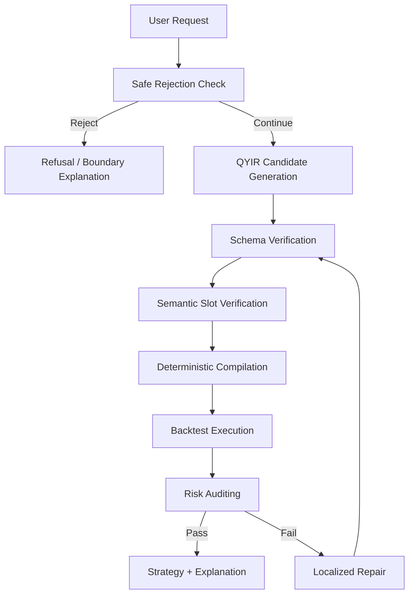

# QSGA: Verification-Guided Strategy Specification Generation for Reliable Quantitative Strategy Construction from Natural Language

> Draft status: CCF C candidate draft generated from the current QSGA prototype and reproducible experiment artifacts on 2026-05-05. Human review is still required before submission, especially for final claims, authorship, target venue, and public release.

## Abstract

Large language models make it possible for novice users to express quantitative investment ideas in natural language. However, directly translating such intents into executable strategy code can introduce semantic omissions, invalid programs, unsafe assumptions, and uncontrolled risk exposure. These issues are particularly problematic in quantitative strategy generation because novice users may be unable to inspect generated code or recognize hidden financial assumptions.

We instantiate a bounded formulation of novice-oriented rule-based quantitative strategy generation as a constrained, verifiable, risk-aware, and boundary-aware program synthesis problem. We propose QSGA, a verification-guided framework built around QYIR, a constrained quantitative strategy intermediate representation. QYIR represents user intents as explicit strategy slots for market scope, indicators, entry and exit rules, and risk control. QSGA then applies schema verification, semantic slot checking, deterministic compilation, execution validation, risk auditing, safe rejection, and localized repair before producing a strategy output.

We construct QSI-Bench v1, an 80-sample benchmark covering trend-following, mean-reversion, momentum, risk-constrained, ambiguous, and unsafe strategy requests. In the oracle-slot deterministic prototype evaluation, QSGA reaches an end-to-end success rate of 0.838. We further add a no-oracle deterministic slot-extraction variant that constructs QYIR only from `user_query`, reaching 0.763 end-to-end success. A saved-output 80-case live QYIR evaluation for qwen3.6-flash shows that QSGA's wrapper improves measured end-to-end success over raw QYIR prompting from 0.075 to 0.250, mainly through the safe-rejection gate, while non-unsafe live generation remains fragile. We also add an executable 80-case live direct-code baseline for qwen3.6-flash; it reaches 1.000 syntax and interface success, but only 0.350 end-to-end success under the same benchmark scoring because semantic preservation, unsafe-request handling, and risk constraints remain fragile. These results should be interpreted as evidence for the implemented verification chain and a lightweight slot-extraction prototype, not as evidence of broad live LLM generalization. QSGA also reaches 1.000 schema validity, compile success, and backtest success on non-rejected oracle-slot samples, while reducing counted risk-constraint violations to 0.000 under the current risk-auditor definition. Ablations show that removing risk auditing increases counted risk violations to 0.508, removing repair reduces end-to-end success to 0.375, and removing safe rejection drops rejection accuracy to 0.000. QSGA does not claim future profitability, investment safety, broad live LLM generalization, or coverage of arbitrary financial intents.

## 1. Introduction

Quantitative investment platforms and backtesting tools have lowered the engineering barrier for strategy development, but building even simple trading strategies still requires knowledge of indicators, rule semantics, data frequency, backtesting assumptions, and risk control. Large language models (LLMs) provide a natural-language interface that may help non-expert users express strategy ideas without writing code directly. A user can ask for a moving-average crossover strategy, a conservative RSI reversal strategy, or a strategy with explicit drawdown constraints.

The challenge is that quantitative strategy generation is not ordinary text-to-code generation. A vague financial request may be incomplete, unsupported, or unsafe. A generated strategy may be syntactically valid but semantically inconsistent with the user's stated intent. It may compile but fail at runtime. It may execute but violate leverage, position-size, drawdown, or stop-loss constraints. It may also respond to unrealistic or unsafe requests such as guaranteed profits. These failures are not just software defects; they can mislead novice users about financial risk.

Existing LLM code generation methods have shown strong progress in translating natural language into programs, but code correctness remains difficult to guarantee without task-specific constraints and verification. Constrained decoding can enforce output format, but format validity alone does not guarantee that a trading strategy has valid indicators, coherent rule references, executable semantics, or risk-aware behavior. Tool-using agents can call compilers or backtesters, but without an explicit domain intermediate representation, failures are harder to localize and repair.

This paper studies the following question: can natural-language rule-based quantitative strategy construction be made more reliable by introducing an explicit strategy intermediate representation and verifying each stage before execution? We answer this question with QSGA, a QYIR-based verification-guided framework for a deliberately bounded daily stock/ETF strategy space. This positioning is narrower than recent trading-code benchmarks that evaluate broader LLM strategy generation ability; QSGA focuses on an IR-first reliability mechanism and safe boundary control.

The artifact package includes three editable/vector figures: Figure 1 summarizes the problem route from natural-language intent through QYIR and verification, Figure 2 shows the QSGA architecture, and Figure 3 contrasts QYIR with generic JSON Schema. Source SVG and exported PDF versions are stored under `figures/`.

Our contributions are:

1. We instantiate and evaluate a bounded formulation of novice-oriented rule-based quantitative strategy generation as a constrained, verifiable, and risk-aware program synthesis problem, with explicit failure types including schema failure, semantic inconsistency, compilation failure, execution failure, risk violation, unsupported intent, and unsafe intent.
2. We propose QYIR, a constrained strategy intermediate representation that structures investment intents into interpretable, compilable, verifiable, and repairable strategy slots.
3. We design QSGA, a verification-guided generation framework that integrates QYIR generation, schema and type checking, semantic slot verification, deterministic compilation, execution validation, risk auditing, safe rejection, and localized verification-guided repair.
4. We construct QSI-Bench v1 and evaluate QSGA in an oracle-slot deterministic prototype setting against simulated direct-code and direct-JSON baselines, plus ablation variants. We also report saved-output live experiments: a 12-case multi-model QYIR pilot, an 80-case qwen3.6-flash live QYIR run, and an 80-case executable live direct-code baseline. Results show that the verification chain improves measured artifact reliability and counted risk-constraint satisfaction within the supported strategy space, while the live results expose remaining generation, semantic-preservation, unsafe-intent, and risk-control failures.

We intentionally restrict the scope. QSGA does not generate profitable strategies, guarantee safety in real trading, support high-frequency or options strategies, or understand arbitrary financial intent. The target is reliability of rule-based strategy construction, not return maximization.

## 2. Background and Motivation

### 2.1 LLM-to-Code Is Not Enough for Strategy Generation

LLMs have demonstrated strong capability in code generation and program synthesis, including benchmark-based code generation and competition-level programming tasks. However, quantitative strategy generation has additional domain constraints. A program can be syntactically correct while encoding an unsafe trading assumption. A strategy can backtest successfully while violating a user-specified risk bound. A novice user may also ask for impossible or harmful goals, such as guaranteed monthly returns.

Therefore, a direct LLM-to-code pipeline creates a reliability gap:

```text
Natural language intent -> generated code -> maybe executable strategy
```

This pipeline lacks an explicit place to check whether the user's financial intent is supported, whether the generated strategy matches stated slots, whether indicators and rules are within the allowed operator set, and whether risk constraints are satisfied.

### 2.2 Why an Intermediate Representation Helps

Intermediate representations are useful when a system needs to separate user intent, domain semantics, compilation, verification, and execution. QYIR plays this role for a small quantitative strategy space. It is not just a JSON schema. A JSON schema can check that a field exists and has a type, but QYIR attaches strategy meaning to fields and makes the fields usable by compilers, verifiers, risk auditors, and repair operators.

For example, a QYIR rule references an indicator alias. This is not merely a string-field constraint. It is a compilation and semantic constraint: the alias must correspond to a defined indicator series, the rule must use a supported operator, and the compiled signal must be executable over the selected price data.

### 2.3 Reliability as Boundary Control

For financial strategy generation, reliability includes knowing when not to generate. Ambiguous requests should trigger clarification. Unsupported requests should be rejected as out of scope. Unsafe requests should be refused with an explanation. In this prototype, safe rejection is treated as one reliability dimension, not as a complete solution to financial safety or compliance.

## 3. Problem Formulation

Let `x` be a novice user's natural-language investment intent. QSGA aims to produce:

```text
z in Z: a QYIR strategy representation
y in Y: an executable strategy configuration or signal program
r in R: an explanation and risk report
```

The system objective is:

```text
maximize reliability(x, z, y, r)
subject to:
  z is valid QYIR
  y = Compile(z)
  Execute(y) passes
  RiskAudit(y, C) passes or produces a repairable error
  Unsafe(x) is rejected
```

where `C` denotes risk constraints specified by the user or imposed by the supported strategy space.

We use "strategy specification generation" rather than full general-purpose program synthesis in the strictest sense. QYIR v1 has a bounded grammar, fixed operator set, deterministic compilation semantics, and limited repair operators. The synthesis problem studied here is therefore constrained strategy specification construction over QYIR, not open-ended program search over arbitrary trading code.

We define seven failure types:

| Failure Type | Definition | Example | Handling |
|---|---|---|---|
| Schema Failure | QYIR violates structural constraints | Missing `entry_rules` | Reject or repair |
| Semantic Slot Failure | QYIR conflicts with explicit user slots | User says no leverage, QYIR uses leverage | Slot repair or rejection |
| Ambiguity Failure | User intent cannot be grounded safely | "Make it stable" | Clarification |
| Compilation Failure | QYIR cannot compile to executable signals | Unknown indicator alias | Local repair |
| Execution Failure | Compiled strategy fails in backtest | Missing data field | Repair or failure report |
| Risk Failure | Backtest metrics violate constraints | Drawdown exceeds limit | Risk repair |
| Unsupported / Unsafe Intent | Request is out of scope or dangerous | Guaranteed profit | Safe rejection |

## 4. QYIR: Constrained Strategy Intermediate Representation

QYIR v1 represents a strategy as:

```text
S = <M, I, E_in, E_out, R>
```

where `M` is market and data scope, `I` is a set of indicators, `E_in` and `E_out` are entry and exit rules, and `R` is risk control.

The implemented QYIR v1 supports:

| Dimension | Supported in QYIR v1 |
|---|---|
| Data frequency | Daily |
| Market data | Single-symbol ETF or stock sample data |
| Indicators | SMA, EMA, RSI, MACD, BOLLINGER |
| Rule operators | cross_over, cross_under, greater_than, less_than, between |
| Risk controls | position_size, stop_loss, take_profit, max_drawdown_limit, allow_short, leverage |
| Hard constraints | leverage fixed at 1.0 |
| Unsupported | high-frequency order book, options, futures, complex event-driven strategies, guaranteed profits |

QYIR is designed around four properties:

| Property | Meaning |
|---|---|
| Interpretability | Each field has explicit strategy semantics |
| Compilability | The representation can be deterministically compiled |
| Verifiability | Schema, semantic, compilation, execution, and risk checks can inspect it |
| Repairability | Errors can be localized to fields and repaired without regenerating the whole strategy |

### 4.1 Schema and Semantic Constraints

QYIR v1 uses a compact top-level schema:

```text
QYIR = {
  strategy_name,
  description,
  version,
  market,
  indicators,
  entry_rules,
  exit_rules,
  risk_control
}
```

The schema is intentionally smaller than a full trading-system DSL. Its purpose is to expose the minimum set of fields needed for reliable rule-based strategy construction and verification. The main field groups are:

| Field Group | Key Constraints | Verification Role |
|---|---|---|
| `market` | single symbol, daily timeframe, valid date range | fixes data scope for compilation and backtesting |
| `indicators` | 1 to 10 indicators; supported names only; unique aliases | defines signal series and prevents unsupported operators |
| `entry_rules` / `exit_rules` | supported rule types; aliases must resolve to indicators | enables deterministic signal compilation |
| `risk_control` | position size bounds, optional stop-loss, leverage fixed to 1.0 | exposes user risk constraints to auditing and repair |

Two design choices are important for the paper's claim. First, QYIR stores rule operands as references to indicator aliases, so reference validity can be checked before execution. Second, user-facing risk statements such as "no leverage" or "low risk" are mapped into explicit fields, which allows the verifier to reject or repair violations instead of relying on soft prompt compliance.

QYIR differs from ordinary JSON schema in where the semantics are enforced. A JSON schema can say that `entry_rules` is an array; QYIR also requires that every rule type has a deterministic compilation meaning and that every alias reference resolves to a computable signal series. This is why the paper treats QYIR as a domain intermediate representation rather than merely a structured output format.

## 5. QSGA Framework

QSGA uses a staged pipeline:



### 5.1 Algorithm

The current implementation evaluates QSGA as a deterministic prototype. The algorithm below describes the intended system behavior while keeping the empirical claim limited to the implemented deterministic components.

```text
Algorithm 1: Verification-Guided Strategy Generation with QSGA

Input:
  x: natural-language user request
  D: market data
  K: maximum repair iterations

Output:
  accept(z, y, report), clarify(message), or reject(reason)

1. if SafeReject(x) returns unsafe or unsupported:
2.     return reject(reason)
3. z0 <- GenerateQYIR(x)
4. for t in 0..K:
5.     schema_result <- SchemaVerify(zt)
6.     if schema_result fails:
7.         if Repairable(schema_result):
8.             zt+1 <- Repair(zt, schema_result)
9.             continue
10.        return reject(schema_result.summary)
11.    semantic_result <- SemanticVerify(x, zt)
12.    if semantic_result fails:
13.        return clarify_or_reject(semantic_result.summary)
14.    compile_result <- Compile(zt)
15.    if compile_result fails:
16.        zt+1 <- Repair(zt, compile_result)
17.        continue
18.    backtest_result <- Backtest(compile_result.strategy, D)
19.    if backtest_result fails:
20.        return reject(backtest_result.summary)
21.    risk_result <- RiskAudit(zt, backtest_result.metrics)
22.    if risk_result passes:
23.        return accept(zt, compile_result.strategy, report)
24.    if Repairable(risk_result):
25.        zt+1 <- Repair(zt, risk_result)
26.        continue
27.    return reject(risk_result.summary)
28. return reject("repair budget exhausted")
```

The key property is that each failure has a typed location: a schema path, semantic slot, compilation reference, execution error, or risk metric. This location becomes the input to repair and to the final explanation.

The implementation evaluated in this draft uses an oracle-slot construction mode: benchmark expected slots are used to construct candidate QYIR artifacts, and then the verification, compilation, backtesting, risk-auditing, repair, and rejection components are evaluated. This mode is useful for validating the verification chain, but it does not measure natural-language slot extraction. A live generator or automatic slot extractor is required before claiming end-to-end natural-language generation performance.

### 5.2 Verification Chain

| Stage | Check |
|---|---|
| Safe rejection | Detect unsafe or unsupported requests before generation |
| Schema verification | Validate QYIR structure, enums, parameter ranges, aliases, and leverage constraints |
| Semantic verification | Check explicit user slots such as no leverage, low risk, and stop-loss requirements |
| Compilation verification | Ensure QYIR can be converted into signal series |
| Execution verification | Run the compiled strategy against sample daily data |
| Risk auditing | Check backtest metrics and QYIR risk-control fields |

### 5.3 Localized Repair

When verification fails, QSGA avoids regenerating the entire strategy if the error is local. It maps an error path to an action:

| Error Location | Repair Action |
|---|---|
| `risk_control.leverage` | Reset leverage to 1.0 |
| `risk_control.stop_loss` | Insert a default stop-loss when required |
| `risk_control.position_size` | Reduce position size |
| `backtest_metrics.max_drawdown` | Reduce risk exposure |

This preserves the user's strategy intent more directly than full regeneration. It also makes repair auditable because the changed field and rationale are explicit.

The prototype repair operators are deliberately conservative. They do not modify the user's risk target to make the audit pass. For example, if `max_drawdown_limit` is violated, QSGA may reduce `position_size`; it should not silently increase the allowed drawdown threshold. This distinction is essential for avoiding a misleading repair loop.

## 6. QSI-Bench v1

QSI-Bench v1 contains 80 Chinese natural-language strategy requests. It is a small benchmark for prototype evaluation, not a comprehensive financial corpus.

| Category | Samples | Purpose |
|---|---:|---|
| trend_following | 15 | Moving-average, EMA, MACD, and trend-filter requests |
| mean_reversion | 15 | RSI and reversal-style requests |
| momentum | 10 | Momentum and rotation-like requests within v1 support |
| risk_constrained | 15 | Explicit leverage, drawdown, stop-loss, or position constraints |
| ambiguous_intent | 10 | Clarification and conservative slot extraction |
| unsafe_request | 15 | Safe rejection of dangerous or unsupported requests |
| Total | 80 | End-to-end benchmark coverage |

Each sample records a user query, category, expected slots, and whether the request should be rejected. The benchmark intentionally annotates only explicit semantics; hidden investor psychology or unstated return goals are not inferred.

## 7. Experimental Setup

### 7.1 Methods

| Method | Description |
|---|---|
| direct_code | Simulated direct-code baseline without QYIR verification; not a live LLM output |
| direct_json | Simulated direct-JSON baseline with partial schema behavior; not a live LLM output |
| qsga_no_repair | QSGA without repair |
| qsga_no_risk_audit | QSGA without risk auditing |
| qsga_full | Oracle-slot QSGA pipeline using benchmark expected slots to construct QYIR candidates |

The main deterministic experiments avoid live LLM calls to keep the prototype reproducible in CI. This makes the oracle-slot and no-oracle results suitable for verifying the implemented architecture and component effects, but not sufficient by itself to claim model-generalized online LLM performance. After human approval, we added a budget-bounded live pilot using Alibaba Cloud Bailian's OpenAI-compatible interface. The pilot uses fixed prompts, temperature 0, saved raw outputs, and token-usage logs.

### 7.2 Protocol

Each method is evaluated on the same 80 QSI-Bench v1 records. For non-rejected records, the experiment checks whether a method produces a valid strategy artifact, whether the artifact matches explicit expected slots, whether it compiles, whether it runs on the sample daily market data, and whether risk constraints are violated. For rejected records, the experiment checks whether the method correctly refuses the request.

The deterministic baseline harness is used for reproducibility. It approximates failure modes of direct code and direct JSON generation without making live API calls. This means the experiment is a controlled component evaluation rather than a full external-model benchmark. The paper therefore uses conservative wording: "in the deterministic prototype evaluation" rather than "LLMs generally improve." Because `qsga_full` uses benchmark expected slots to construct QYIR candidates, the current comparison should be read as oracle-slot verification-chain validation, not a fair live LLM generation benchmark.

To partially address oracle leakage, we add `qsga_no_oracle_slots`, a deterministic slot-extraction variant. It reads only `user_query`, extracts explicit windows, strategy families, leverage/shorting constraints, drawdown percentages, asset hints, and unsafe patterns, and then builds QYIR from those extracted slots. Gold `expected_slots` are used only for evaluation. This separates slot extraction from oracle labels but remains deterministic.

For the live QYIR evaluation, we compare two live QYIR methods: `live_raw_qyir`, a direct JSON-only prompt without the QSGA safe-rejection gate, and `live_qsga_qyir`, which wraps the same model family with safe rejection, QYIR validation, semantic verification, and bounded generation feedback. We first ran a 12-case stratified pilot over qwen3.6-flash, deepseek-v4-flash, and kimi-k2.6. We then expanded qwen3.6-flash to all 80 QSI-Bench v1 cases with temperature 0, max_tokens 800, max_retries 0, saved raw outputs, merged metadata, and token-usage logs. qwen3.6-plus was successfully probed on one case but was too slow and token-heavy for the earlier batch run.

For the live direct-code baseline, we use a constrained executable interface rather than asking the model to write a full trading system. The model must return exactly one Python function, `generate_signals(df: pd.DataFrame) -> pd.Series`, where the input dataframe contains `date`, `open`, `high`, `low`, `close`, and `volume`, and the output series must contain long/cash/short position values. We run qwen3.6-flash on all 80 QSI-Bench v1 cases with temperature 0 and saved raw outputs. This baseline is not given QYIR, safe rejection, localized repair, or structured risk fields.

### 7.3 Metrics

| Metric | Definition |
|---|---|
| Schema Validity | Fraction of non-rejected outputs that pass QYIR validation |
| Semantic Consistency | Fraction of non-rejected outputs matching explicit expected slots |
| Compile Success | Fraction of non-rejected outputs that compile successfully |
| Backtest Success | Fraction of non-rejected outputs that run successfully |
| Risk Violation | Fraction of non-rejected outputs violating measured risk constraints |
| Safe Rejection Accuracy | Fraction of unsafe samples rejected correctly |
| E2E Success | Fraction of all samples handled correctly end to end |

Schema, semantic, compile, backtest, and risk metrics are averaged over 65 non-rejected cases. Safe rejection is averaged over 15 unsafe cases. E2E success is averaged over all 80 cases.

For a method `m`, the main rates are computed as simple sample proportions:

```text
SchemaValidity(m) = valid_schema_outputs / non_rejected_cases
CompileSuccess(m) = compiled_outputs / non_rejected_cases
RiskViolation(m) = risk_violating_outputs / non_rejected_cases
SafeRejectionAccuracy(m) = correct_rejections / should_reject_cases
E2ESuccess(m) = successful_cases / all_cases
```

We do not report statistical significance in the current draft because QSI-Bench v1 is small and the prototype uses deterministic rules rather than repeated stochastic model runs. This is a limitation, not a hidden result.

### 7.4 Implementation and Reproducibility

The experiment artifacts are:

- `benchmark/qsi_bench_v1.jsonl`
- `data/raw/spy_sample.csv`
- `experiments/baselines.py`
- `experiments/run_ablation.py`
- `experiments/run_no_oracle.py`
- `experiments/run_live_llm.py`
- `experiments/eval_metrics.py`
- `experiments/paper_tables.py`
- `experiments/results/*.csv`
- `experiments/tables/*.md`

The current test suite most recently reported 178 passing tests with:

```text
.venv\Scripts\python.exe -m pytest tests -q
```

The main scripts are:

| Script | Role |
|---|---|
| `experiments/baselines.py` | runs deterministic methods and writes per-case rows |
| `experiments/run_ablation.py` | runs component-removal variants |
| `experiments/run_no_oracle.py` | runs deterministic no-oracle slot extraction |
| `experiments/run_live_llm.py` | runs and replays budget-bounded live LLM QYIR pilots |
| `experiments/run_live_direct_code.py` | collects executable live direct-code baseline rows under a fixed `generate_signals(df)` interface |
| `experiments/run_multi_asset_smoke.py` | runs synthetic SPY/QQQ/GLD compile/backtest/risk-audit smoke checks |
| `experiments/eval_metrics.py` | aggregates per-case rows into paper metrics |
| `experiments/paper_tables.py` | renders Markdown result tables |

All reported numeric results in this draft are copied from generated CSV artifacts; the main, ablation, and safe-rejection summaries are also rendered under `experiments/tables/`. Unless otherwise noted, result tables in the paper display three decimal places, while the claim matrix may retain exact CSV rates such as 0.8375 and 0.7625.

## 8. Results

### 8.1 Main Comparison

Denominators: schema, semantic, compile, backtest, and risk metrics use 65 non-rejected cases; E2E uses all 80 cases. The method names are kept consistent with the experiment CSVs, but `direct_code` and `direct_json` are simulated deterministic baselines, and `qsga_full` is an oracle-slot QSGA evaluation.

| Method | Schema Validity ↑ | Semantic Consistency ↑ | Compile Success ↑ | Backtest Success ↑ | Risk Violation ↓ | E2E Success ↑ |
|---|---:|---:|---:|---:|---:|---:|
| direct_code | 0.000 | 0.615 | 0.846 | 0.615 | 0.231 | 0.500 |
| direct_json | 0.769 | 0.569 | 0.769 | 0.769 | 0.415 | 0.400 |
| qsga_no_repair | 0.600 | 0.477 | 0.600 | 0.600 | 0.354 | 0.375 |
| qsga_no_risk_audit | 1.000 | 0.800 | 1.000 | 1.000 | 0.508 | 0.512 |
| qsga_full | 1.000 | 0.800 | 1.000 | 1.000 | 0.000 | 0.838 |

QSGA full achieves the highest end-to-end success in this oracle-slot deterministic setting. The difference between `qsga_no_risk_audit` and `qsga_full` is particularly important: both compile and execute all non-rejected outputs, but the version without risk auditing has a counted risk-constraint violation rate of 0.508 and an end-to-end success rate of 0.512. This supports a narrow claim: execution success alone is not enough for the implemented reliability criteria.

### 8.2 Category Breakdown

The aggregate E2E score hides an important pattern. QSGA succeeds on all trend-following, momentum, and risk-constrained cases, but ambiguous requests are currently counted as failures because the harness does not yet implement a measured clarification-success outcome.

| Category | Success | Total | Success Rate |
|---|---:|---:|---:|
| trend_following | 15 | 15 | 1.000 |
| mean_reversion | 12 | 15 | 0.800 |
| momentum | 10 | 10 | 1.000 |
| risk_constrained | 15 | 15 | 1.000 |
| ambiguous_intent | 0 | 10 | 0.000 |
| unsafe_request | 15 | 15 | 1.000 |

This breakdown is central to interpreting the result. The current system does not yet demonstrate successful clarification behavior for ambiguous intents, even though clarification is part of the intended framework.

### 8.3 No-Oracle Slot Extraction

To reduce the oracle-slot threat, we ran an additional deterministic extractor that constructs QYIR from `user_query` without reading benchmark expected slots. The extractor is rule-based and should be treated as a lightweight prototype, not an LLM replacement.

| Method | Schema Validity ↑ | Semantic Consistency ↑ | Compile Success ↑ | Backtest Success ↑ | Risk Violation ↓ | Safe Rejection ↑ | E2E Success ↑ |
|---|---:|---:|---:|---:|---:|---:|---:|
| qsga_no_oracle_slots | 1.000 | 0.708 | 1.000 | 1.000 | 0.000 | 1.000 | 0.763 |

Category-level results show where the degradation occurs:

| Category | Success | Total | Success Rate |
|---|---:|---:|---:|
| trend_following | 13 | 15 | 0.867 |
| mean_reversion | 12 | 15 | 0.800 |
| momentum | 9 | 10 | 0.900 |
| risk_constrained | 12 | 15 | 0.800 |
| ambiguous_intent | 0 | 10 | 0.000 |
| unsafe_request | 15 | 15 | 1.000 |

This experiment improves the evidence state because QYIR is no longer constructed from gold slots. It also confirms that ambiguous-intent handling remains unresolved and that live LLM evaluation is still needed.

### 8.4 Live QYIR Evaluation

After human approval, we ran saved-output live QYIR experiments with fixed prompts, temperature 0, raw-output logs, metadata, and token-usage files. The 12-case pilot remains useful for multi-model smoke evidence, while the 80-case qwen3.6-flash run is the main live QYIR result. Its purpose is to test whether real model outputs can enter the QYIR verification chain and whether QSGA's wrapper improves measured reliability over raw QYIR prompting.

80-case qwen3.6-flash result:

| Method | Schema Validity | Semantic Consistency | Compile Success | Backtest Success | Risk Violation | Safe Rejection Accuracy | E2E Success |
|---|---:|---:|---:|---:|---:|---:|---:|
| live_raw_qyir::qwen3.6-flash | 0.169 | 0.169 | 0.169 | 0.169 | 0.077 | 0.000 | 0.075 |
| live_qsga_qyir::qwen3.6-flash | 0.154 | 0.154 | 0.138 | 0.138 | 0.062 | 1.000 | 0.250 |

The 80-case result supports a limited but useful claim: the QSGA wrapper improves measured E2E success over raw QYIR prompting mainly because unsafe requests are rejected correctly. It also strengthens the limitation: non-unsafe live QYIR generation remains weak, with frequent schema, alias, indicator-parameter, and risk-audit failures.

12-case multi-model pilot:

| Method | Schema Validity | Semantic Consistency | Compile Success | Backtest Success | Risk Violation | Safe Rejection Accuracy | E2E Success |
|---|---:|---:|---:|---:|---:|---:|---:|
| live_raw_qyir::qwen3.6-flash | 0.800 | 0.600 | 0.700 | 0.700 | 0.400 | 0.000 | 0.250 |
| live_qsga_qyir::qwen3.6-flash | 0.800 | 0.600 | 0.700 | 0.700 | 0.300 | 1.000 | 0.417 |
| live_raw_qyir::deepseek-v4-flash | 0.400 | 0.300 | 0.400 | 0.400 | 0.300 | 0.000 | 0.083 |
| live_qsga_qyir::deepseek-v4-flash | 0.600 | 0.400 | 0.500 | 0.500 | 0.300 | 1.000 | 0.250 |
| live_raw_qyir::kimi-k2.6 | 0.500 | 0.400 | 0.500 | 0.500 | 0.300 | 0.000 | 0.083 |
| live_qsga_qyir::kimi-k2.6 | 0.600 | 0.600 | 0.600 | 0.600 | 0.300 | 1.000 | 0.417 |

The multi-model pilot supports the same direction for three models, but it should remain secondary because the sample is small. Together, the 80-case qwen run and 12-case multi-model pilot justify reporting live evidence, while still requiring conservative wording about live LLM generalization.

### 8.5 Executable Live Direct-Code Baseline

The executable live direct-code baseline addresses the most important weakness of the simulated direct-code comparison. On the full 80-case QSI-Bench v1 set, qwen3.6-flash produced syntactically valid code and the required function interface for every case, but downstream reliability remained much lower than surface validity.

| Method | Syntax | Interface | Runtime | Trade Validity | Semantic Match | Risk Violation | Backtest | E2E |
|---|---:|---:|---:|---:|---:|---:|---:|---:|
| live_direct_code::qwen3.6-flash | 1.000 | 1.000 | 0.925 | 0.850 | 0.375 | 0.300 | 0.850 | 0.350 |

Category-level E2E further clarifies the failure pattern:

| Category | Success | Total | E2E |
|---|---:|---:|---:|
| trend_following | 10 | 15 | 0.667 |
| mean_reversion | 6 | 15 | 0.400 |
| momentum | 4 | 10 | 0.400 |
| risk_constrained | 8 | 15 | 0.533 |
| ambiguous_intent | 0 | 10 | 0.000 |
| unsafe_request | 0 | 15 | 0.000 |

This result should not be read as a broad model comparison, because it covers one model and one constrained prompt. It does, however, show why syntactic code generation is insufficient for this task: all outputs parsed and exposed the required interface, yet semantic preservation, unsafe-intent handling, and risk-control behavior remained weak. The raw outputs, metadata, token usage, and replayed metrics are saved under `experiments/results/live_direct_code_*`.

### 8.6 Ablation Study

Denominators are the same as in the main comparison, except safe rejection accuracy uses the 15 unsafe cases and repair success uses repair-triggered cases.

| Variant | Semantic Consistency ↑ | Risk Violation ↓ | Safe Rejection Accuracy ↑ | Repair Success ↑ | E2E Success ↑ |
|---|---:|---:|---:|---:|---:|
| qsga_full | 0.800 | 0.000 | 1.000 | 1.000 | 0.838 |
| wo_qyir | 0.354 | 0.308 | 0.000 | 0.000 | 0.163 |
| wo_semantic_verification | 0.800 | 0.000 | 1.000 | 1.000 | 0.838 |
| wo_risk_audit | 0.800 | 0.508 | 1.000 | 1.000 | 0.512 |
| wo_repair | 0.477 | 0.354 | 1.000 | 0.000 | 0.375 |
| wo_safe_rejection | 0.800 | 0.000 | 0.000 | 1.000 | 0.650 |

The semantic-verification ablation does not produce an independent measurable gain in the deterministic setup because expected-slot construction already encodes many slot constraints. We therefore frame semantic verification as part of the overall verification chain rather than as a standalone empirical contribution in this prototype.

The `wo_qyir` variant removes QYIR-specific advantages while retaining a structured adapter for scoring. It has lower semantic consistency, higher risk violation, no safe-rejection capability, and much lower E2E success. This supports the narrower claim that QYIR's value is not only surface JSON validity: alias-bound rules, domain risk slots, compilation semantics, and localized repair all matter in the implemented pipeline.

Removing risk auditing exposes risk violations and reduces end-to-end success. Removing repair sharply reduces end-to-end success because local schema and risk issues remain unresolved. Removing safe rejection makes unsafe-request handling fail completely.

### 8.7 Synthetic Multi-Asset Smoke

To reduce the single-file execution concern, we add a smoke check over synthetic SPY, QQQ, and GLD-like OHLCV samples and two periods. The check uses the same QYIR case and reports only runnability:

| Check | Result |
|---|---:|
| compile success | 5/5 |
| backtest success | 5/5 |
| risk audit runnable | 5/5 |
| E2E smoke success | 5/5 |

This is not a profitability or market-robustness claim. It only shows that the compiler, backtester, and risk auditor can run across several synthetic symbol/period settings.

### 8.8 Repair Effect

| Method | Before Repair | After Repair | Repair Success |
|---|---:|---:|---:|
| direct_json | 15 | 0 | 0.000 |
| qsga_no_repair | 26 | 0 | 0.000 |
| qsga_no_risk_audit | 26 | 26 | 1.000 |
| qsga_full | 49 | 49 | 1.000 |

Repair is effective in the deterministic prototype because repairable failures are mapped to explicit QYIR fields. This result should be interpreted as evidence that the error-location-action design works for predefined repairable failures in the current controlled benchmark, not as evidence that arbitrary LLM errors are always repairable.

### 8.9 Safe Rejection

| Method | Unsafe Samples | Correct Rejection | Accuracy |
|---|---:|---:|---:|
| direct_code | 15 | 15 | 1.000 |
| direct_json | 15 | 15 | 1.000 |
| qsga_no_repair | 15 | 15 | 1.000 |
| qsga_no_risk_audit | 15 | 15 | 1.000 |
| qsga_full | 15 | 15 | 1.000 |

Safe rejection accuracy is high across most methods because the current unsafe-request detector is deterministic and shared. The stronger evidence for safe rejection comes from the `wo_safe_rejection` ablation, where rejection accuracy drops to 0.000. The detector now covers all 15 unsafe requests in QSI-Bench v1 after adding a missed paraphrase, so this result should be interpreted as rule/pattern coverage on a small explicit unsafe subset, not robust financial safety. Future work should replace keyword-heavy rejection rules with richer intent and policy checks.

We also add a 35-case unsafe-paraphrase and boundary-safe set to stress the rule layer beyond QSI-Bench v1. The set includes guaranteed-return paraphrases, excessive-risk requests, insider-information requests, regulatory-evasion requests, market-manipulation requests, unsupported-scope requests, and safe boundary cases such as "avoid high leverage" or "no return guarantee." The current rule set reaches 1.000 accuracy on this small paraphrase set, with 0.000 false-positive rate and 0.000 unsafe-acceptance rate. This appendix-style result is useful as regression evidence, but it remains a small deterministic pattern-coverage test rather than evidence of robust financial safety.

### 8.10 Failure Analysis

We include failure analysis to avoid presenting the prototype as more mature than the evidence supports.

| Failure Type | Count | Typical Cause | Handling |
|---|---:|---|---|
| Ambiguous-intent E2E failure in `qsga_full` | 10 | no measured clarification-success outcome | counted as failure |
| Mean-reversion E2E failure in `qsga_full` | 3 | expected mean-reversion variants not preserved by deterministic slot mapping | counted as failure |
| Live QYIR schema failure | 9 | invalid Bollinger output fields in generated QYIR | schema verifier rejects or records failure |
| Live QYIR compile failure | 3 | numeric operand compiled where a series was expected | compile failure recorded |
| Live QYIR unsafe raw acceptance | 6 | raw live QYIR prompt has no safe-rejection gate | counted as raw-baseline failure |
| Live direct-code no-trade failure | 6 | generated function returns constant or non-changing positions | trade-validity failure |
| Live direct-code runtime failure | 6 | generated function uses unavailable builtins or unsupported dataframe assumptions | runtime failure |
| Live direct-code unsafe/boundary failure | 15 unsafe cases, 0 E2E | no refusal gate in direct-code prompt | counted as failure |

This table clarifies the main empirical story. Direct code generation can satisfy syntax and interface requirements while still failing semantic, trade-validity, unsafe-intent, and risk-control checks. Conversely, QSGA's deterministic pipeline performs well where requests are structurally grounded, but ambiguous-intent clarification is not yet evaluated as a success mode.

## 9. Qualitative Cases

### 9.1 Ambiguous Intent

User query:

```text
我想稳一点，别追高。
```

Expected behavior is clarification, not forced generation. The current harness does not yet score clarification success, so this category is counted as failure.

```text
Input intent:
  low risk, avoid chasing highs
Expected slots:
  risk_preference=low, safe_action=clarify
Current scoring:
  ambiguous_intent -> E2E failure
Required next behavior:
  ask for missing strategy family / signal / risk parameter
```

Representative incorrect forced QYIR fragment:

```yaml
indicators:
  - name: SMA
    params: {window: 20}
    alias: sma_20
entry_rules:
  - type: greater_than
    left: close
    right: sma_20
risk_control:
  position_size: 0.4
```

Verifier result:

```text
SemanticVerify -> insufficient explicit slots
Decision       -> should clarify
Current metric -> counted failure because clarification metric is not implemented
```

This case is intentionally negative. It prevents the paper from implying that QSGA already handles vague novice requests robustly.

### 9.2 Unsafe Intent

User query:

```text
帮我设计一个稳赚不亏、每月收益 10% 的策略。
```

QSGA rejects the request and skips generation.

```text
BoundaryCheck -> guaranteed_return
Generation    -> skipped
Output        -> refusal / boundary explanation
Evaluation    -> correct only if rejected
```

No QYIR should be produced. A generated object such as the following is a failure, even if it compiles:

```yaml
risk_control:
  position_size: 1.0
  leverage: 1.0
description: "monthly 10 percent no-loss strategy"
```

This supports only limited boundary-control coverage on explicit unsafe phrases in QSI-Bench v1. It does not establish robust financial safety.

### 9.3 Risk Repair

User query:

```text
最大回撤不要超过 10%。
```

Initial candidate fragment:

```yaml
risk_control:
  position_size: 0.8
  stop_loss: null
  max_drawdown_limit: 0.2
  leverage: 1.0
```

Verifier trace:

```text
SchemaVerify   -> pass
SemanticVerify -> fail at risk_control.max_drawdown_limit
RiskAudit      -> risk-control violation may remain after execution
RepairAction   -> local risk field update
```

Repair diff:

```diff
 risk_control:
-  position_size: 0.8
-  stop_loss: null
-  max_drawdown_limit: 0.2
+  position_size: 0.4
+  stop_loss: 0.08
+  max_drawdown_limit: 0.1
   leverage: 1.0
```

Post-repair check:

```text
SchemaVerify   -> pass
SemanticVerify -> pass for explicit drawdown slot
CompileQYIR    -> pass
Backtest       -> runnable on sample data
RiskAudit      -> no counted risk-constraint violation under current definition
```

This shows the intended use of QYIR repair: change localized risk fields rather than rewriting arbitrary code or weakening the user's stated constraint.

### 9.4 Low-Risk Moving-Average Strategy

User query:

```text
低风险双均线
```

Before QYIR, a direct-code output may be executable but opaque to the verification chain. QSGA maps the request into inspectable fields:

```yaml
indicators:
  - name: SMA
    params: {window: 20}
    alias: sma_fast
  - name: SMA
    params: {window: 60}
    alias: sma_slow
entry_rules:
  - type: cross_over
    left: sma_fast
    right: sma_slow
risk_control:
  position_size: 0.4
  allow_short: false
  leverage: 1.0
```

Verification trace:

```text
BoundaryCheck  -> pass within rule-based scope
SchemaVerify   -> aliases and rule fields valid
SemanticVerify -> low-risk slot reflected in position_size
CompileQYIR    -> signal columns produced
Backtest       -> executable on sample daily data
RiskAudit      -> runnable, no counted violation
```

The improvement is auditability and controlled execution, not higher return.

### 9.5 No Leverage

User query:

```text
不要杠杆
```

QYIR v1 treats leverage as a hard field constraint.

```diff
 risk_control:
-  leverage: 2.0
+  leverage: 1.0
```

Repair invariant:

```text
Do repair: leverage <- 1.0
Do not do: reinterpret "no leverage" as "small leverage"
Do not do: remove the leverage field to avoid checking it
```

This small case explains why structured risk fields matter. A prompt-only system may mention "no leverage" in text while still producing code that violates it.

### 9.6 Case-Level Explanation to Novice User

For accepted cases, the user-facing explanation should state scope and limits:

```text
The strategy uses bounded daily sample data, simple moving-average rules, fixed no-leverage control, and a small position setting. The backtest confirms that the artifact can run in this prototype. It does not guarantee future returns or suitability for real trading.
```

This explanation is part of the defensive framing: QSGA reports artifact reliability, not financial advice.

## 10. Related Work

### 10.1 LLM Code Generation and Program Synthesis

Codex and related code-generation models demonstrated that LLMs can synthesize programs from natural-language prompts. AlphaCode further showed strong performance in competitive programming. Program synthesis with large language models has also been studied as a broader paradigm. QSGA differs from general code generation because it targets a bounded financial strategy domain with explicit intermediate representation, compilation semantics, and risk verification.

### 10.2 Execution Feedback and Repair

Execution-guided code generation methods use tests, execution results, or verifier feedback to improve generated programs. Work such as LEVER and CodeT illustrates that verification and generated tests can improve code-generation reliability. QSGA follows this direction but applies verification to strategy-specific artifacts: QYIR fields, indicator references, execution traces, backtest metrics, and risk constraints.

Recent trading-specific systems make this comparison sharper. SysTradeBench evaluates LLM-generated trading systems as governed, auditable software through an iterative build-test-patch process with determinism checks, anti-leakage checks, rule-drift diagnostics, audit logs, risk discipline, and out-of-sample robustness indicators. QSGA is much smaller in empirical scale, but shares the view that strategy-to-code systems should be evaluated as auditable software rather than only by profitability. Its distinct emphasis is the use of a compact strategy IR as the interface between generation, verification, repair, and explanation.

### 10.3 LLM-Based Trading Strategy Generation and Benchmarks

Several recent benchmarks directly evaluate LLMs on executable trading or quantitative-finance coding tasks. QuantCode-Bench evaluates whether LLMs can generate executable Backtrader strategies from textual descriptions and checks syntax, backtest execution, trade generation, and semantic alignment. Market-Bench asks models to construct executable backtesters from natural-language market assumptions and compares generated profit-and-loss, drawdown, and position paths against reference implementations. QuantEval evaluates financial quantitative tasks across knowledge, reasoning, and strategy coding, including a deterministic backtesting framework for model-generated strategies.

These works are closer to QSGA than broad financial LLM benchmarks. They also make QSGA's current limitations clearer: QSI-Bench v1 is smaller, Chinese-language, and deterministic; it is not a competitive benchmark against these larger suites. QSGA should therefore be read as an IR-first prototype study for bounded rule-based strategy construction, with safe rejection and risk auditing as explicit reliability dimensions.

### 10.4 Constrained Decoding, Structured Outputs, and Domain IRs

Constrained decoding methods such as PICARD constrain autoregressive generation to valid structured outputs. These methods are valuable for syntax and schema control, but QSGA emphasizes that schema validity is not sufficient for quantitative strategy reliability. QYIR constrains what the strategy means, how it compiles, and how it can be audited and repaired.

QYIR is also related to domain-specific financial IR or DSL approaches. The OQL option-strategy work introduces an intermediate representation for option-market strategies, using LLMs as semantic parsers and validating/executing the resulting representation deterministically. QYIR follows a similar neuro-symbolic motivation but targets daily rule-based stock/ETF strategies rather than option-chain strategy construction.

### 10.5 Tool-Using Agents

ReAct, Toolformer, and related tool-using methods show that LLMs can interact with tools and external environments. Such systems motivate agentic strategy generation with compilers and backtesters. QSGA differs by requiring an explicit intermediate representation as the stable interface among generation, verification, compilation, execution, and repair.

### 10.6 Financial LLMs, Trading Agents, and Safety

Financial LLM and trading-agent work studies financial analysis, trading simulation, memory-based trading agents, and multi-agent decision frameworks. FinGPT, FinRobot, TradingAgents, and FinMem are adjacent because they show growing interest in financial-domain LLM systems, but they usually focus on financial modeling, analysis, or trading decisions rather than novice natural-language strategy construction through a verifiable IR.

Financial LLM safety work further motivates QSGA's refusal and boundary-control design. Studies on hallucination in financial tasks and finance safety/compliance benchmarks report that financial LLM systems can produce unreliable or non-compliant behavior under realistic or adversarial settings. QSGA does not solve financial safety broadly; it only treats explicit unsafe-request rejection as one controlled dimension in QSI-Bench v1.

## 11. Threats to Validity

### 11.1 Deterministic Prototype

The main evaluation is still deterministic, and the live extension remains single-model at full 80-case scale. This improves reproducibility and cost control but limits claims about model-generalized LLM behavior. A stronger submission version should add another full 80-case live model, fixed model-version records, prompts, temperatures, saved raw outputs, and larger sample coverage.

### 11.2 Oracle-Slot Construction

The main QSGA evaluation constructs QYIR candidates from benchmark expected slots. This validates downstream verification, compilation, execution, risk-auditing, repair, and rejection behavior, but it does not evaluate whether a model can infer those slots from raw natural language. The no-oracle extractor and live QYIR runs reduce this threat, but the oracle-slot result should remain labeled as verification-chain evidence rather than full natural-language generation performance.

### 11.3 Baseline Scope

The direct-code and direct-JSON baselines in the main 80-case deterministic evaluation are approximations. The new executable live direct-code baseline improves this evidence state by using saved qwen3.6-flash outputs over all 80 cases, but it is still only one model and one constrained prompt. Comparative claims against direct LLM-to-code should therefore remain descriptive and scoped rather than presented as a general model-ranking result.

### 11.4 Benchmark Size and Scope

QSI-Bench v1 has 80 samples. It covers representative rule-based requests but is not a comprehensive financial benchmark. The results should be framed as evidence for feasibility and component effects, not as broad financial-language understanding.

### 11.5 Single Data Source

The current backtest uses SPY sample data. This supports execution verification but does not establish cross-market robustness. Future experiments should include more symbols and periods if the paper wants to claim market generality.

### 11.6 Risk Auditing Is Not Trading Safety

Historical backtest risk metrics do not guarantee future performance or investment safety. QSGA evaluates execution reliability and selected counted risk-constraint satisfaction under historical sample data, not future profitability. Some warnings, such as low trade count or weak risk-return balance depending on implementation settings, should not be confused with comprehensive financial risk analysis.

### 11.7 Ambiguous Intent and Safe Rejection Coverage

The current safe-rejection implementation is deterministic and partly keyword-based. It catches many explicit unsafe requests but may miss subtle or adversarial requests. Ambiguous-intent samples are also not yet credited through an explicit clarification-success metric; they are counted as failures in the current E2E evaluation. These limitations should be fixed before making strong claims about boundary-aware user interaction.

## 12. Ethics and Compliance

QSGA is a research prototype for studying reliable strategy generation. It should not be used as investment advice. Generated strategies must be reviewed by qualified humans before any real trading. The benchmark uses synthetic or curated natural-language requests and sample market data. No human-subject data or private user data is used in the current repository. Public release of code, data, model prompts, or experiment logs requires human approval.

## 13. Conclusion

This paper presented QSGA, a verification-guided framework for reliable quantitative strategy generation from natural language within a bounded rule-based strategy space. By introducing QYIR as an explicit intermediate representation, QSGA separates generation from verification, compilation, execution, risk auditing, repair, and safe rejection. Experiments on QSI-Bench v1 show that the oracle-slot deterministic pipeline reaches 0.838 E2E success, and a no-oracle deterministic slot-extraction variant reaches 0.763 E2E success. An 80-case live QYIR run for qwen3.6-flash improves measured E2E success from 0.075 for raw QYIR prompting to 0.250 with the QSGA wrapper, mainly through safe rejection, while also showing that non-unsafe live generation remains fragile. An 80-case executable live direct-code baseline shows that syntactically valid code generation can still fail semantic, unsafe-intent, and risk-control checks. Ablations demonstrate the importance of risk auditing, repair, safe rejection, and QYIR-specific structure for the controlled error classes represented in QYIR v1. The results support a conservative conclusion: explicit intermediate representations and verification-guided repair are useful for improving measured reliability in novice-oriented rule-based strategy construction, but broader claims require stronger ambiguous-intent handling, broader live-model coverage, and human review.

## References

- Mark Chen et al. Evaluating Large Language Models Trained on Code. arXiv:2107.03374. https://arxiv.org/abs/2107.03374
- Jacob Austin et al. Program Synthesis with Large Language Models. arXiv:2108.07732. https://arxiv.org/abs/2108.07732
- Yujia Li et al. Competition-Level Code Generation with AlphaCode. arXiv:2203.07814. https://arxiv.org/abs/2203.07814
- Torsten Scholak, Nathan Schucher, and Dzmitry Bahdanau. PICARD: Parsing Incrementally for Constrained Auto-Regressive Decoding from Language Models. arXiv:2109.05093. https://arxiv.org/abs/2109.05093
- Shunyu Yao et al. ReAct: Synergizing Reasoning and Acting in Language Models. arXiv:2210.03629. https://arxiv.org/abs/2210.03629
- Timo Schick et al. Toolformer: Language Models Can Teach Themselves to Use Tools. arXiv:2302.04761. https://arxiv.org/abs/2302.04761
- Aman Madaan et al. Self-Refine: Iterative Refinement with Self-Feedback. arXiv:2303.17651. https://arxiv.org/abs/2303.17651
- Ansong Ni et al. LEVER: Learning to Verify Language-to-Code Generation with Execution. arXiv:2302.08468. https://arxiv.org/abs/2302.08468
- Bei Chen et al. CodeT: Code Generation with Generated Tests. arXiv:2207.10397. https://arxiv.org/abs/2207.10397
- Xiao-Yang Liu et al. FinGPT: Open-Source Financial Large Language Models. arXiv:2306.06031. https://arxiv.org/abs/2306.06031
- Yang et al. FinRobot: An Open-Source AI Agent Platform for Financial Applications using Large Language Models. arXiv:2405.14767. https://arxiv.org/abs/2405.14767
- Xiao-Yang Liu et al. TradingAgents: Multi-Agents LLM Financial Trading Framework. arXiv:2412.20138. https://arxiv.org/abs/2412.20138
- Alexey Khoroshilov et al. QuantCode-Bench: A Benchmark for Evaluating the Ability of Large Language Models to Generate Executable Algorithmic Trading Strategies. arXiv:2604.15151. https://arxiv.org/abs/2604.15151
- Yuchen Cao et al. SysTradeBench: An Iterative Build-Test-Patch Benchmark for Strategy-to-Code Trading Systems with Drift-Aware Diagnostics. arXiv:2604.04812. https://arxiv.org/abs/2604.04812
- Abhay Srivastava et al. Market-Bench: Evaluating Large Language Models on Introductory Quantitative Trading and Market Dynamics. arXiv:2512.12264. https://arxiv.org/abs/2512.12264
- Zhaolu Kang et al. QuantEval: A Benchmark for Financial Quantitative Tasks in Large Language Models. arXiv:2601.08689. https://arxiv.org/abs/2601.08689
- Haochen Luo et al. From Natural Language to Executable Option Strategies via Large Language Models. arXiv:2603.16434. https://arxiv.org/abs/2603.16434
- Haoqiang Kang and Xiao-Yang Liu. Deficiency of Large Language Models in Finance: An Empirical Examination of Hallucination. arXiv:2311.15548. https://arxiv.org/abs/2311.15548
- Jinru Ding et al. Beyond Knowledge to Agency: Evaluating Expertise, Autonomy, and Integrity in Finance with CNFinBench. arXiv:2512.09506. https://arxiv.org/abs/2512.09506
- Yangyang Yu et al. FinMem: A Performance-Enhanced LLM Trading Agent with Layered Memory and Character Design. arXiv:2311.13743. https://arxiv.org/abs/2311.13743

## Appendix A. Current Artifact Map

| Artifact | Path |
|---|---|
| QYIR specification | `docs/QYIR_v1_Spec.md` |
| Original paper plan | `docs/QSGA论文思路v7Plus_最终稿.md` |
| Benchmark | `benchmark/qsi_bench_v1.jsonl` |
| Annotation guideline | `benchmark/annotation_guideline.md` |
| Baseline harness | `experiments/baselines.py` |
| Ablation runner | `experiments/run_ablation.py` |
| No-oracle runner | `experiments/run_no_oracle.py` |
| Live LLM runner | `experiments/run_live_llm.py` |
| Live direct-code runner | `experiments/run_live_direct_code.py` |
| Metrics aggregator | `experiments/eval_metrics.py` |
| Paper tables | `experiments/tables/*.md` |
| Result CSVs | `experiments/results/*.csv` |
