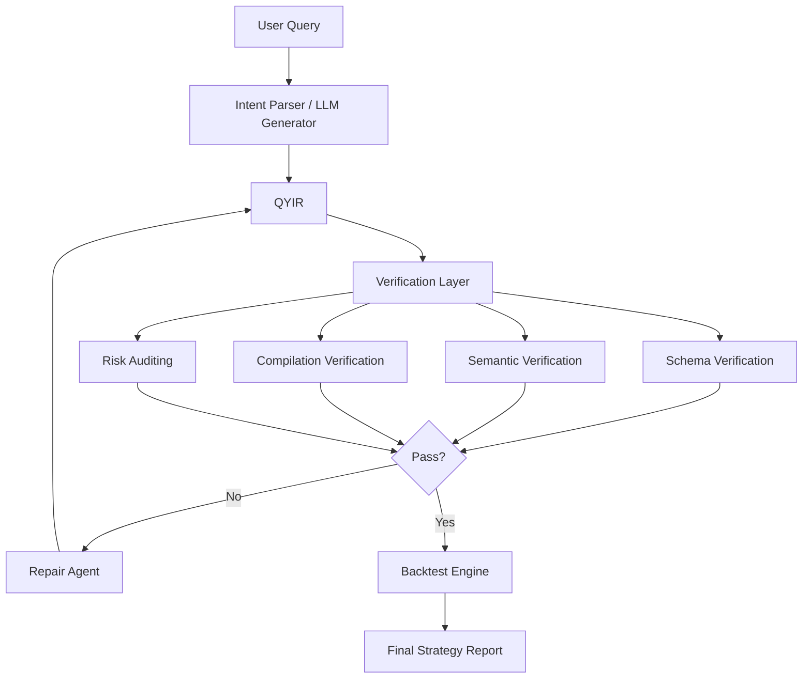
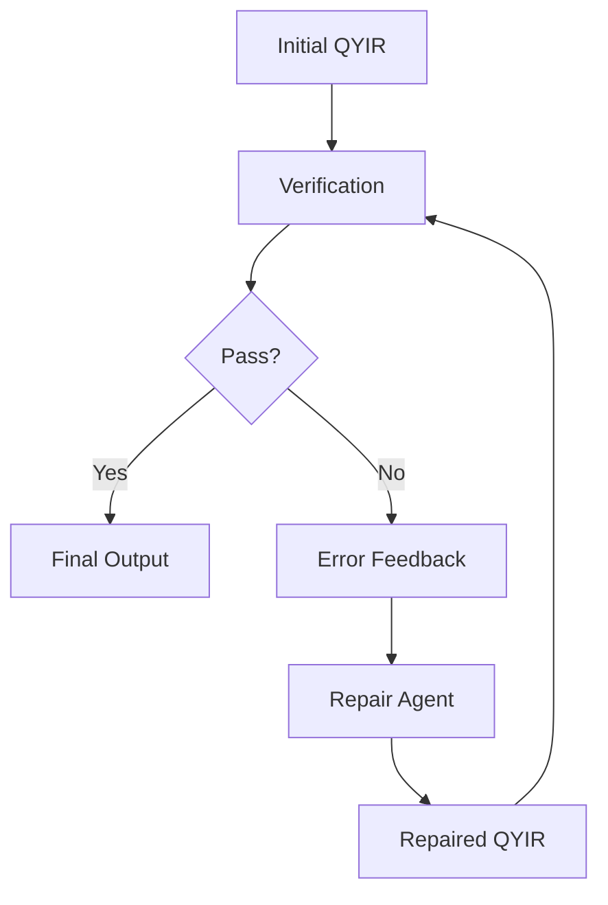

# QSGA Architecture Diagrams

## Overall Architecture

```mermaid
flowchart TD
    U["User Query"] --> G["Intent Parser / LLM Generator"]
    G --> Q["QYIR"]
    Q --> V["Verification Layer"]
    V --> S["Schema Verification"]
    V --> M["Semantic Verification"]
    V --> C["Compilation Verification"]
    V --> R["Risk Auditing"]
    S --> D{"Pass?"}
    M --> D
    C --> D
    R --> D
    D -- "No" --> A["Repair Agent"]
    A --> Q
    D -- "Yes" --> B["Backtest Engine"]
    B --> F["Final Strategy Report"]
```

## Verification-Guided Repair

```mermaid
flowchart TD
    I["Initial QYIR"] --> V["Verification"]
    V --> P{"Pass?"}
    P -- "Yes" --> O["Final Output"]
    P -- "No" --> E["Error Feedback"]
    E --> A["Repair Agent"]
    A --> R["Repaired QYIR"]
    R --> V
```

